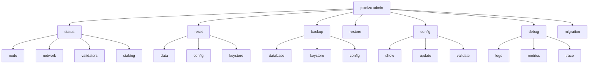
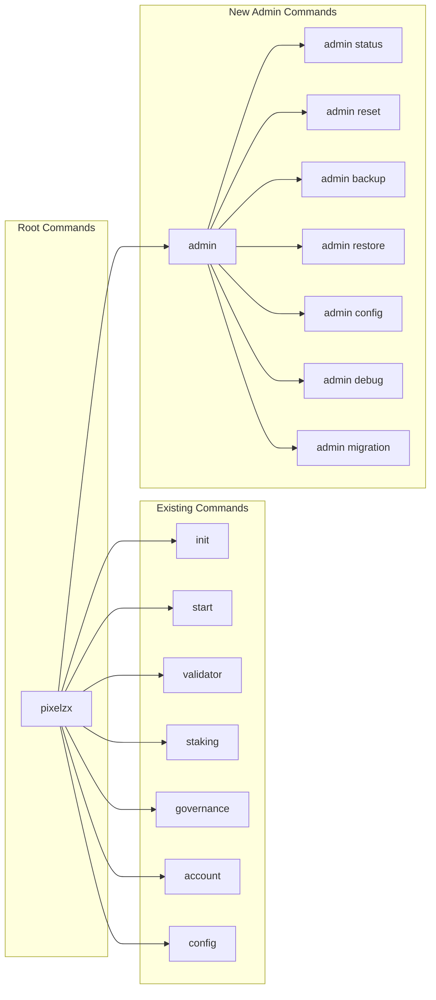
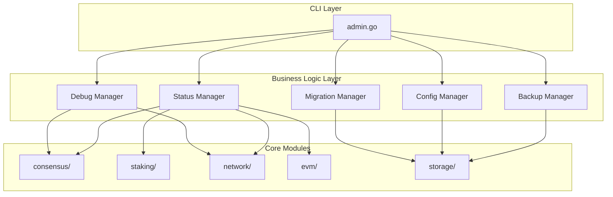
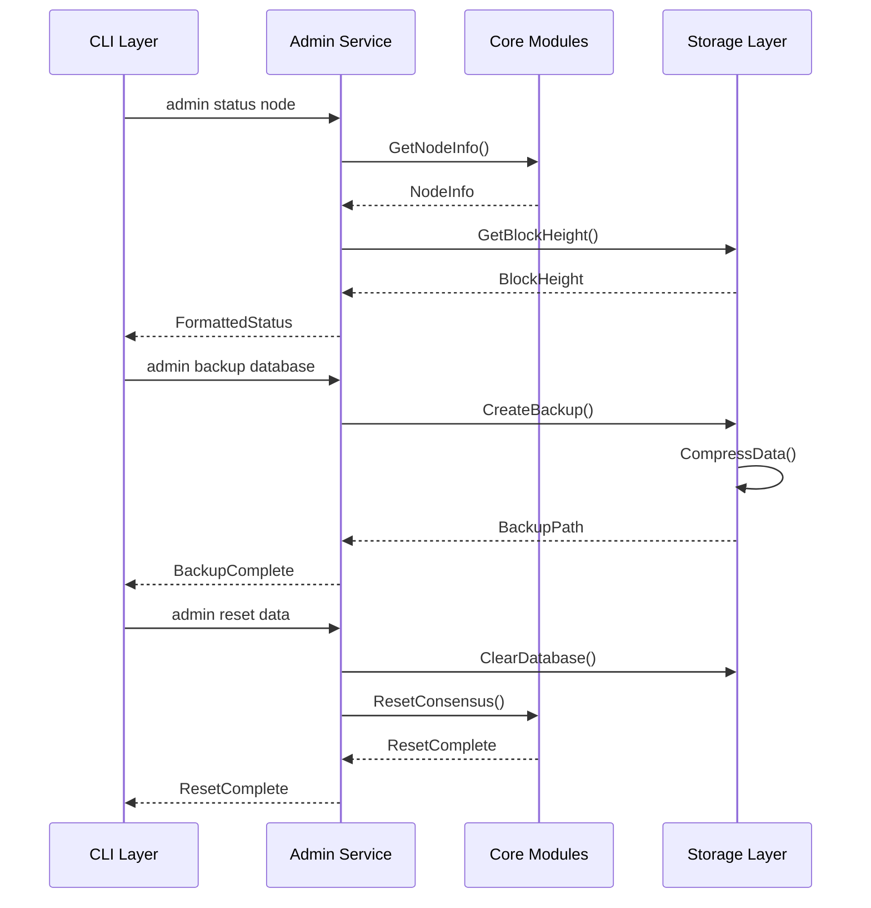
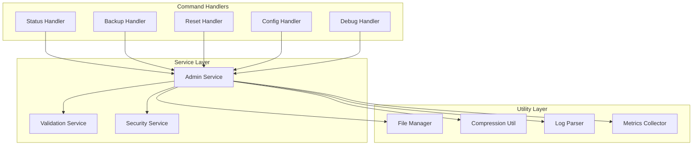
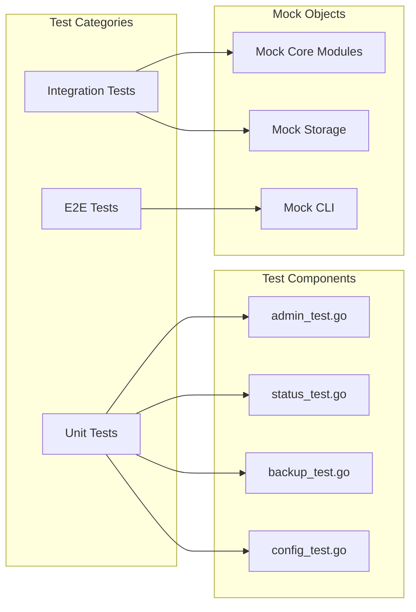

# PIXELZX Admin 명령어 설계

## Overview
PIXELZX CLI에서 발생하는 `Error: unknown command "admin"` 오류를 해결하기 위해 admin 명령어를 설계합니다. admin 명령어는 블록체인 노드의 고급 관리 기능을 제공하며, 노드 운영자와 시스템 관리자를 위한 통합 관리 인터페이스를 제공합니다.

## Technology Stack & Dependencies
- **Framework**: Cobra CLI 라이브러리 기반
- **Language**: Go 1.21+
- **Integration**: 기존 PIXELZX 모듈과 완전 호환
- **Dependencies**: 
  - github.com/spf13/cobra v1.8.0
  - 기존 consensus, staking, network 모듈

## Architecture

### Admin 명령어 구조


### 명령어 계층 구조


## Component Architecture

### Admin 명령어 모듈 설계


### Admin 명령어 세부 기능

#### 1. Status 명령어
- **목적**: 노드의 전체 상태를 모니터링하고 진단
- **하위 명령어**:
  - `pixelzx admin status node` - 노드 기본 정보 및 상태
  - `pixelzx admin status network` - P2P 네트워크 연결 상태
  - `pixelzx admin status validators` - 검증자 세트 정보
  - `pixelzx admin status staking` - 스테이킹 풀 상태

#### 2. Reset 명령어
- **목적**: 노드 데이터 및 설정 초기화
- **하위 명령어**:
  - `pixelzx admin reset data` - 블록체인 데이터 삭제
  - `pixelzx admin reset config` - 설정 파일 기본값 복원
  - `pixelzx admin reset keystore` - 키스토어 초기화

#### 3. Backup 명령어
- **목적**: 중요 데이터 백업 관리
- **하위 명령어**:
  - `pixelzx admin backup database` - 블록체인 데이터베이스 백업
  - `pixelzx admin backup keystore` - 키스토어 백업
  - `pixelzx admin backup config` - 설정 파일 백업

#### 4. Restore 명령어
- **목적**: 백업된 데이터 복원
- **기능**: 백업 파일로부터 노드 상태 복원

#### 5. Config 명령어
- **목적**: 고급 설정 관리
- **하위 명령어**:
  - `pixelzx admin config show` - 현재 설정 표시
  - `pixelzx admin config update` - 설정 업데이트
  - `pixelzx admin config validate` - 설정 유효성 검증

#### 6. Debug 명령어
- **목적**: 디버깅 및 진단 도구
- **하위 명령어**:
  - `pixelzx admin debug logs` - 로그 분석 도구
  - `pixelzx admin debug metrics` - 성능 메트릭 수집
  - `pixelzx admin debug trace` - 트랜잭션 추적

#### 7. Migration 명령어
- **목적**: 데이터 마이그레이션 및 업그레이드
- **기능**: 버전 간 데이터 호환성 관리

## Data Models

### Admin 상태 모델
```mermaid
erDiagram
    AdminStatus {
        string NodeID
        string Version
        uint64 ChainID
        uint64 CurrentBlock
        string SyncStatus
        time LastBlockTime
        int PeerCount
        bool IsValidator
    }
    
    NetworkStatus {
        int ConnectedPeers
        []string PeerList
        string NetworkID
        bool P2PEnabled
        string ListenAddress
    }
    
    ValidatorStatus {
        int TotalValidators
        int ActiveValidators
        bool IsCurrentValidator
        decimal StakingBalance
        decimal TotalStaked
    }
    
    SystemHealth {
        decimal CPUUsage
        decimal MemoryUsage
        decimal DiskUsage
        string Uptime
        []string ActiveServices
    }
    
    AdminStatus ||--|| NetworkStatus : contains
    AdminStatus ||--|| ValidatorStatus : contains
    AdminStatus ||--|| SystemHealth : contains
```

## API Integration Layer

### Admin 서비스 인터페이스


## Business Logic Layer

### Admin 서비스 구현 패턴


## Testing Strategy

### 단위 테스트 구조


### 테스트 케이스 정의

| 테스트 분류 | 테스트 케이스 | 예상 결과 |
|------------|-------------|----------|
| **Status Tests** | `admin status node` 명령어 실행 | 노드 정보 정상 표시 |
| | 네트워크 연결 없는 상태에서 status 확인 | 적절한 오류 메시지 |
| | 잘못된 하위 명령어 사용 | 사용법 안내 메시지 |
| **Backup Tests** | 정상적인 데이터베이스 백업 | 백업 파일 생성 확인 |
| | 권한 없는 디렉토리에 백업 시도 | 권한 오류 처리 |
| | 백업 중 프로세스 중단 | 안전한 롤백 |
| **Reset Tests** | 데이터 디렉토리 리셋 | 모든 데이터 안전 삭제 |
| | 실행 중인 노드에서 리셋 시도 | 안전 확인 프롬프트 |
| **Config Tests** | 설정 파일 유효성 검증 | 올바른 검증 결과 |
| | 잘못된 설정값 업데이트 시도 | 검증 실패 메시지 |

### 보안 고려사항

| 보안 영역 | 위험 요소 | 완화 방안 |
|---------|---------|---------|
| **데이터 접근** | 무단 데이터베이스 접근 | 권한 검증 및 접근 제어 |
| **백업 보안** | 백업 파일 노출 | 암호화 및 안전한 저장 |
| **설정 변경** | 악의적 설정 변경 | 설정 검증 및 백업 |
| **명령어 실행** | 권한 없는 명령어 실행 | 관리자 권한 확인 |

## 파일 구조 및 구현

### 새로 추가될 파일들
```
cmd/pixelzx/commands/
├── admin.go              # 메인 admin 명령어
├── admin_status.go       # status 하위 명령어
├── admin_backup.go       # backup/restore 명령어
├── admin_config.go       # config 관리 명령어
├── admin_debug.go        # debug 도구
└── admin_migration.go    # 마이그레이션 도구

admin/                    # 새로운 admin 모듈
├── service.go           # Admin 서비스 인터페이스
├── status.go            # 상태 관리
├── backup.go            # 백업/복원 관리
├── config.go            # 설정 관리
├── debug.go             # 디버깅 도구
├── migration.go         # 마이그레이션 관리
└── utils.go             # 공통 유틸리티

admin/test/               # 테스트 파일
├── admin_test.go
├── status_test.go
├── backup_test.go
└── config_test.go
```

### main.go 수정사항
```go
// 기존 명령어 목록에 admin 명령어 추가
rootCmd.AddCommand(
    commands.InitCmd(),
    commands.StartCmd(),
    commands.ValidatorCmd(),
    commands.StakingCmd(),
    commands.GovernanceCmd(),
    commands.AccountCmd(),
    commands.ConfigCmd(),
    commands.AdminCmd(),  // 새로 추가
    commands.VersionCmd(),
)
```

## 구현 우선순위

### Phase 1: 기본 인프라
1. **Admin 명령어 기본 구조 생성**
   - admin.go 파일 생성
   - 기본 명령어 등록
   - help 메시지 구현

2. **Status 명령어 구현**
   - 노드 상태 확인 기능
   - 네트워크 상태 표시
   - 기본 검증자 정보

### Phase 2: 관리 기능
1. **Backup/Restore 기능**
   - 데이터베이스 백업
   - 설정 파일 백업
   - 복원 기능

2. **Reset 기능**
   - 안전한 데이터 삭제
   - 설정 초기화

### Phase 3: 고급 기능
1. **Debug 도구**
   - 로그 분석
   - 메트릭 수집
   - 성능 모니터링

2. **Migration 도구**
   - 버전 업그레이드 지원
   - 데이터 호환성 관리

## 사용 예시

### 기본 사용법
```bash
# Admin 명령어 도움말
pixelzx admin --help

# 노드 상태 확인
pixelzx admin status node

# 네트워크 상태 확인
pixelzx admin status network

# 데이터베이스 백업
pixelzx admin backup database --output /backup/pixelzx-backup.tar.gz

# 설정 파일 확인
pixelzx admin config show

# 노드 데이터 리셋 (확인 프롬프트 포함)
pixelzx admin reset data --confirm

# 디버그 로그 분석
pixelzx admin debug logs --level error --since 24h
```

### 고급 사용법
```bash
# 특정 경로에 백업 생성
pixelzx admin backup database --output /custom/path/backup.tar.gz --compress

# 설정 업데이트
pixelzx admin config update --key network.p2p_port --value 30304

# 실시간 메트릭 모니터링
pixelzx admin debug metrics --live --interval 5s

# 마이그레이션 실행
pixelzx admin migration run --from v1.0.0 --to v1.1.0
```