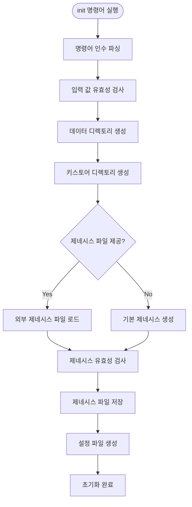
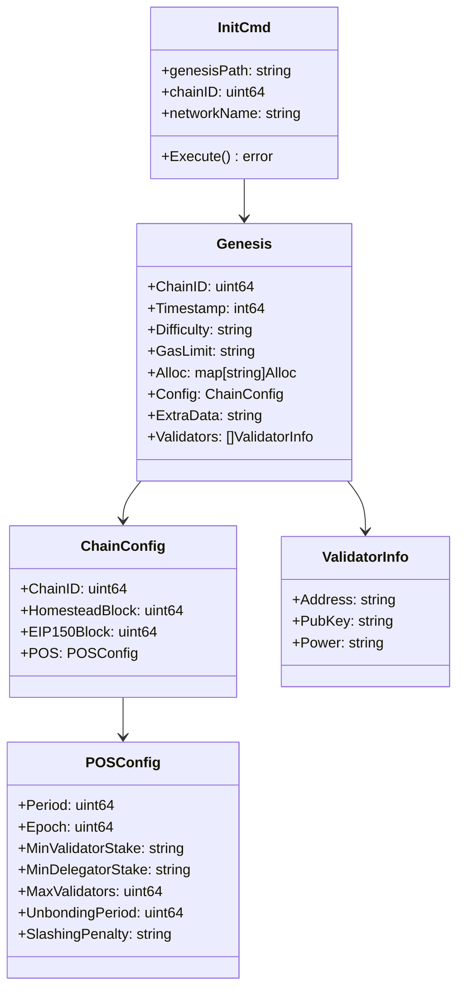
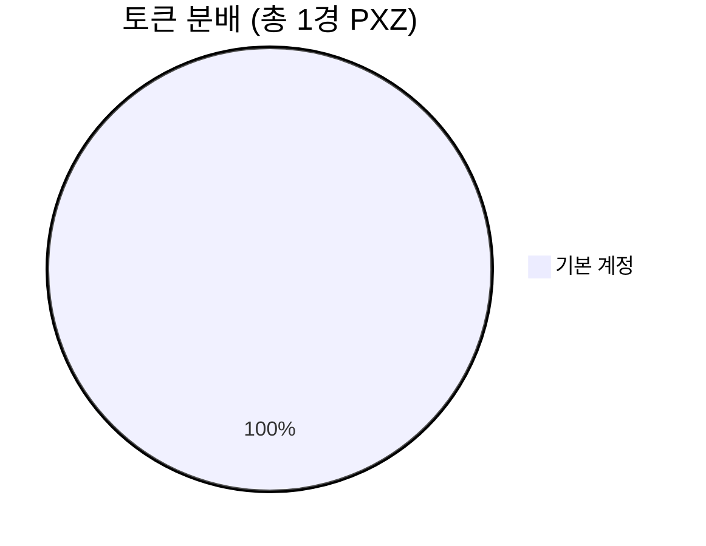
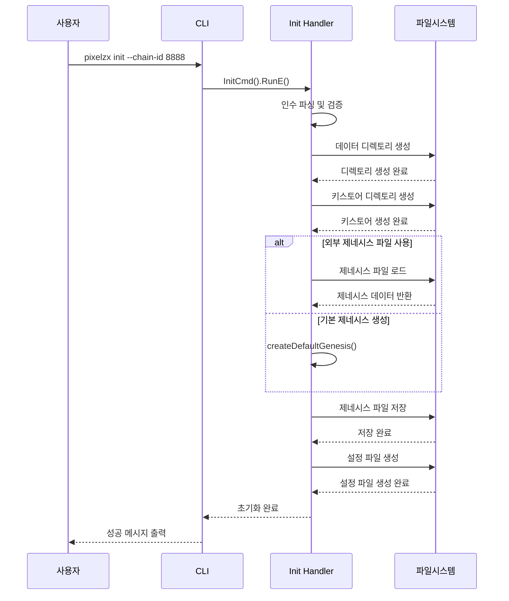
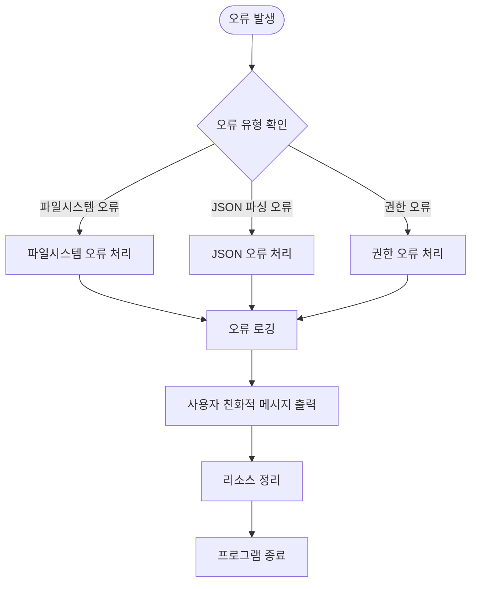

# PIXELZX POS EVM 체인 초기화 방법 설계

## 개요

PIXELZX POS EVM 체인의 초기화는 새로운 블록체인 네트워크를 시작하기 위한 핵심 과정입니다. 이 과정은 제네시스 블록 생성, 노드 설정, 키스토어 디렉토리 생성 등을 포함하며, CLI 명령어를 통해 자동화된 방식으로 수행됩니다.

## 기술 스택

- **언어**: Go 1.21+
- **CLI 프레임워크**: Cobra
- **설정 형식**: YAML, JSON
- **암호화**: 이더리움 호환 키스토어

## 아키텍처

### 초기화 프로세스 흐름



### 컴포넌트 아키텍처



## 초기화 방법

### 1. 기본 초기화

가장 간단한 형태의 초기화로, 기본 설정을 사용합니다.

```bash
pixelzx init
```

**생성되는 구조**:
```
data/
├── genesis.json      # 제네시스 블록 정의
├── config.yaml      # 노드 설정 파일
└── keystore/        # 키스토어 디렉토리
```

### 2. 네트워크 이름 지정 초기화

특정 네트워크 이름으로 초기화합니다.

```bash
pixelzx init my-network
```

### 3. 사용자 정의 설정 초기화

체인 ID와 네트워크 이름을 명시적으로 지정합니다.

```bash
pixelzx init --chain-id 8888 --network pixelzx-mainnet
```

### 4. 외부 제네시스 파일 사용

기존 제네시스 파일을 사용하여 초기화합니다.

```bash
pixelzx init --genesis ./custom-genesis.json --chain-id 8888
```

### 5. 데이터 디렉토리 지정

특정 디렉토리에 데이터를 저장합니다.

```bash
pixelzx init --datadir /path/to/custom/data
```

## 제네시스 블록 구성

### 기본 제네시스 설정

| 항목 | 기본값 | 설명 |
|------|--------|------|
| Chain ID | 8888 | 체인 식별자 |
| Block Time | 3초 | 블록 생성 간격 |
| Gas Limit | 30,000,000 | 블록당 최대 가스 |
| Epoch Length | 200 블록 | 에포크 길이 |
| Min Validator Stake | 1,000,000,000 PXZ | 최소 검증자 스테이킹 |
| Min Delegator Stake | 10,000 PXZ | 최소 위임자 스테이킹 |
| Max Validators | 125명 | 최대 검증자 수 |
| Unbonding Period | 21일 | 언본딩 기간 |
| Slashing Penalty | 5% | 슬래싱 페널티 |

### 토큰 경제학



**초기 토큰 할당**:
- 총 공급량: 10,000,000,000,000,000 PXZ (1경 PXZ)
- 기본 계정: `0x742d35Cc6635C0532925a3b8D5C0532925b8D5C05`
- 할당량: 전체 공급량의 100%

## 설정 파일 구조

### config.yaml 구성

```yaml
# 네트워크 설정
network:
  name: "pixelzx-pos"
  chain_id: 8888
  block_time: 3s
  epoch_length: 200

# 노드 설정
node:
  name: "pixelzx-node"
  datadir: "./data"
  log_level: "info"

# P2P 네트워크
p2p:
  port: 30303
  max_peers: 50
  bootnode_addrs: []

# JSON-RPC API
rpc:
  enabled: true
  host: "0.0.0.0"
  port: 8545
  apis: ["eth", "net", "web3", "personal", "admin", "debug", "txpool", "pxz"]

# WebSocket API
websocket:
  enabled: true
  host: "0.0.0.0"
  port: 8546
  apis: ["eth", "net", "web3", "pxz"]

# 검증자 설정
validator:
  enabled: false
  address: ""
  password_file: ""

# 스테이킹 설정
staking:
  min_validator_stake: "1000000000000000000000000000"
  min_delegator_stake: "10000000000000000000000"
  unbonding_period: "504h"
  max_validators: 125
```

## 초기화 명령어 세부 사항

### 명령어 구조

```go
pixelzx init [network-name] [flags]
```

### 플래그 옵션

| 플래그 | 타입 | 기본값 | 설명 |
|--------|------|--------|------|
| `--genesis` | string | - | 외부 제네시스 파일 경로 |
| `--chain-id` | uint64 | 8888 | 체인 ID |
| `--network` | string | "pixelzx-pos" | 네트워크 이름 |
| `--datadir` | string | "./data" | 데이터 디렉토리 |

### 초기화 순서



## 오류 처리

### 일반적인 오류 시나리오

| 오류 | 원인 | 해결 방법 |
|------|------|-----------|
| 디렉토리 생성 실패 | 권한 부족 | 적절한 권한으로 실행 |
| 제네시스 파일 로드 실패 | 파일이 존재하지 않음 | 올바른 파일 경로 확인 |
| JSON 파싱 오류 | 잘못된 제네시스 형식 | 제네시스 파일 구문 검사 |
| 설정 파일 생성 실패 | 디스크 공간 부족 | 충분한 디스크 공간 확보 |

### 오류 처리 흐름



## 검증 및 테스트

### 초기화 검증 체크리스트

- [ ] 데이터 디렉토리 생성 확인
- [ ] 키스토어 디렉토리 생성 확인
- [ ] 제네시스 파일 생성 및 형식 검증
- [ ] 설정 파일 생성 및 구문 검증
- [ ] 파일 권한 설정 확인
- [ ] 체인 ID 일관성 확인

### 테스트 시나리오

```bash
# 1. 기본 초기화 테스트
pixelzx init
test -f data/genesis.json && echo "✅ 제네시스 파일 생성됨"
test -f data/config.yaml && echo "✅ 설정 파일 생성됨"
test -d data/keystore && echo "✅ 키스토어 디렉토리 생성됨"

# 2. 사용자 정의 설정 테스트
pixelzx init --chain-id 9999 --network test-net
grep "9999" data/genesis.json && echo "✅ 체인 ID 올바름"
grep "test-net" data/config.yaml && echo "✅ 네트워크 이름 올바름"

# 3. 외부 제네시스 파일 테스트
pixelzx init --genesis ./custom-genesis.json
diff ./custom-genesis.json data/genesis.json && echo "✅ 제네시스 파일 복사됨"
```

## 모범 사례

### 1. 프로덕션 환경 초기화

```bash
# 프로덕션 체인 ID 사용
pixelzx init --chain-id 8888 --network pixelzx-mainnet --datadir /var/lib/pixelzx
```

### 2. 테스트 환경 초기화

```bash
# 테스트 체인 ID 사용
pixelzx init --chain-id 1337 --network pixelzx-testnet --datadir ./testdata
```

### 3. 개발 환경 초기화

```bash
# 개발용 설정으로 초기화
pixelzx init --chain-id 31337 --network pixelzx-dev
```

### 4. 기존 네트워크 참여

```bash
# 기존 네트워크의 제네시스 파일 사용
pixelzx init --genesis ./mainnet-genesis.json --chain-id 8888
```

## 보안 고려사항

### 키스토어 보안

- 키스토어 디렉토리는 소유자만 읽기/쓰기 권한 (0700)
- 개인키 파일은 소유자만 읽기 권한 (0600)
- 정기적인 백업 및 암호화 저장

### 제네시스 파일 검증

- 제네시스 파일의 해시값 검증
- 초기 계정 할당의 적절성 확인
- PoS 파라미터의 합리성 검토

### 네트워크 설정 보안

- P2P 포트 방화벽 설정
- API 엔드포인트 접근 제어
- TLS 인증서 설정 (프로덕션 환경)