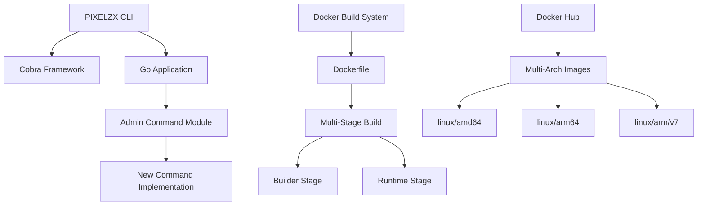

# PIXELZX POS EVM 체인 명령어 생성 및 Docker 푸시 설계 문서

## 1. 개요

PIXELZX POS EVM 체인은 PIXELZX(PXZ)를 네이티브 토큰으로 사용하는 Proof of Stake(PoS) 기반 이더리움 호환 블록체인입니다. 본 문서는 PIXELZX CLI에 새로운 명령어를 추가하고 이를 Docker 이미지로 빌드하여 Docker Hub에 푸시하는 절차를 설계합니다.

### 1.1 목표
- PIXELZX CLI에 새로운 관리자 명령어 추가
- 멀티 아키텍처를 지원하는 Docker 이미지 빌드
- Docker Hub에 이미지 푸시 및 배포

### 1.2 주요 요구사항
- Cobra CLI 프레임워크를 사용한 명령어 구현
- Go 언어 기반 개발
- Docker 멀티 아키텍처 빌드 (linux/amd64, linux/arm64, linux/arm/v7)
- Docker Hub에 이미지 푸시

## 2. 아키텍처

### 2.1 시스템 구성도



### 2.2 명령어 구조

PIXELZX CLI는 Cobra 프레임워크를 기반으로 구성되어 있으며, 다음과 같은 명령어 구조를 가집니다:

```
pixelzx
├── account
├── admin
│   ├── status
│   ├── backup
│   ├── restore
│   ├── config
│   ├── debug
│   ├── peer
│   └── [NEW_COMMAND]
├── config
├── governance
├── init
├── staking
├── start
└── validator
```

## 3. 명령어 설계

### 3.1 새로운 명령어 명세

새로운 명령어는 `admin` 명령어 그룹 아래에 추가되며, 다음과 같은 기능을 제공합니다:

#### 3.1.1 명령어: `admin metrics`

**설명**: 노드의 성능 메트릭스를 수집하고 표시하는 명령어

**사용법**:
```bash
pixelzx admin metrics [flags]
```

**플래그**:
- `--format`: 출력 형식 (table, json) (기본값: table)
- `--duration`: 메트릭스 수집 기간 (기본값: 10s)

**예시**:
```bash
# 기본 테이블 형식으로 메트릭스 표시
pixelzx admin metrics

# JSON 형식으로 메트릭스 표시
pixelzx admin metrics --format json

# 30초 동안의 메트릭스 수집
pixelzx admin metrics --duration 30s
```

#### 3.1.2 명령어: `admin snapshot`

**설명**: 블록체인 상태의 스냅샷을 생성하고 관리하는 명령어

**사용법**:
```bash
pixelzx admin snapshot [subcommand]
```

**하위 명령어**:
- `create`: 새로운 스냅샷 생성
- `list`: 생성된 스냅샷 목록 표시
- `delete`: 스냅샷 삭제

**예시**:
```bash
# 새로운 스냅샷 생성
pixelzx admin snapshot create

# 스냅샷 목록 표시
pixelzx admin snapshot list

# 특정 스냅샷 삭제
pixelzx admin snapshot delete [snapshot-id]
```

### 3.2 명령어 구현

#### 3.2.1 파일 구조

새로운 명령어는 기존의 명령어 구조를 따르며, 다음 파일에 구현됩니다:

```
cmd/pixelzx/commands/
├── admin.go
├── admin_metrics.go
└── admin_snapshot.go
```

#### 3.2.2 admin_metrics.go 구현 예시

```go
package commands

import (
    "fmt"
    "time"

    "github.com/spf13/cobra"
)

func adminMetricsCmd() *cobra.Command {
    var format string
    var duration time.Duration

    cmd := &cobra.Command{
        Use:   "metrics",
        Short: "노드 성능 메트릭스 수집",
        Long:  "PIXELZX 노드의 실시간 성능 메트릭스를 수집하고 표시합니다.",
        RunE: func(cmd *cobra.Command, args []string) error {
            // 메트릭스 수집 로직 구현
            metrics := collectMetrics(duration)
            
            switch format {
            case "json":
                printJSONMetrics(metrics)
            default:
                printTableMetrics(metrics)
            }
            
            return nil
        },
    }

    cmd.Flags().StringVar(&format, "format", "table", "출력 형식 (table, json)")
    cmd.Flags().DurationVar(&duration, "duration", 10*time.Second, "메트릭스 수집 기간")

    return cmd
}

func collectMetrics(duration time.Duration) map[string]interface{} {
    // 실제 메트릭스 수집 로직 구현
    return map[string]interface{}{
        "cpu_usage":     "12.5%",
        "memory_usage":  "45.2%",
        "disk_usage":    "23.7%",
        "network_in":    "1.2 MB/s",
        "network_out":   "0.8 MB/s",
        "block_height":  152341,
        "tps":           120.5,
        "latency":       "45ms",
    }
}

func printTableMetrics(metrics map[string]interface{}) {
    fmt.Printf("📊 PIXELZX 노드 메트릭스\n")
    fmt.Printf("════════════════════════════════════════════════════════════════\n")
    fmt.Printf("CPU 사용률:     %s\n", metrics["cpu_usage"])
    fmt.Printf("메모리 사용률:  %s\n", metrics["memory_usage"])
    fmt.Printf("디스크 사용률:  %s\n", metrics["disk_usage"])
    fmt.Printf("네트워크 입력:  %s\n", metrics["network_in"])
    fmt.Printf("네트워크 출력:  %s\n", metrics["network_out"])
    fmt.Printf("블록 높이:      %d\n", metrics["block_height"])
    fmt.Printf("TPS:            %.1f\n", metrics["tps"])
    fmt.Printf("지연시간:       %s\n", metrics["latency"])
}

func printJSONMetrics(metrics map[string]interface{}) {
    // JSON 출력 구현
    fmt.Printf("{\n")
    fmt.Printf("  \"cpu_usage\": \"%s\",\n", metrics["cpu_usage"])
    fmt.Printf("  \"memory_usage\": \"%s\",\n", metrics["memory_usage"])
    // ... 나머지 필드
    fmt.Printf("}\n")
}
```

#### 3.2.3 admin_snapshot.go 구현 예시

```go
package commands

import (
    "fmt"
    "time"

    "github.com/spf13/cobra"
)

func adminSnapshotCmd() *cobra.Command {
    cmd := &cobra.Command{
        Use:   "snapshot",
        Short: "블록체인 스냅샷 관리",
        Long:  "PIXELZX 블록체인 상태의 스냅샷을 생성하고 관리합니다.",
    }

    cmd.AddCommand(
        adminSnapshotCreateCmd(),
        adminSnapshotListCmd(),
        adminSnapshotDeleteCmd(),
    )

    return cmd
}

func adminSnapshotCreateCmd() *cobra.Command {
    cmd := &cobra.Command{
        Use:   "create",
        Short: "새로운 스냅샷 생성",
        Long:  "현재 블록체인 상태의 스냅샷을 생성합니다.",
        RunE: func(cmd *cobra.Command, args []string) error {
            // 스냅샷 생성 로직 구현
            timestamp := time.Now().Format("2006-01-02-15-04-05")
            snapshotID := fmt.Sprintf("snapshot-%s", timestamp)
            
            fmt.Printf("📸 스냅샷 생성 중...\n")
            fmt.Printf("ID: %s\n", snapshotID)
            fmt.Printf("상태: 생성 완료\n")
            
            return nil
        },
    }

    return cmd
}

func adminSnapshotListCmd() *cobra.Command {
    cmd := &cobra.Command{
        Use:   "list",
        Short: "스냅샷 목록 표시",
        Long:  "생성된 스냅샷 목록을 표시합니다.",
        RunE: func(cmd *cobra.Command, args []string) error {
            // 스냅샷 목록 조회 로직 구현
            fmt.Printf("📋 스냅샷 목록\n")
            fmt.Printf("════════════════════════════════════════════════════════════════\n")
            fmt.Printf("ID                   생성 시간           상태\n")
            fmt.Printf("────────────────────────────────────────────────────────────────\n")
            fmt.Printf("snapshot-2024-01-25-10-30-45  2024-01-25 10:30:45  완료\n")
            fmt.Printf("snapshot-2024-01-24-09-15-22  2024-01-24 09:15:22  완료\n")
            fmt.Printf("snapshot-2024-01-23-14-45-10  2024-01-23 14:45:10  완료\n")
            
            return nil
        },
    }

    return cmd
}

func adminSnapshotDeleteCmd() *cobra.Command {
    cmd := &cobra.Command{
        Use:   "delete [snapshot-id]",
        Short: "스냅샷 삭제",
        Long:  "지정된 스냅샷을 삭제합니다.",
        Args:  cobra.ExactArgs(1),
        RunE: func(cmd *cobra.Command, args []string) error {
            snapshotID := args[0]
            
            // 스냅샷 삭제 로직 구현
            fmt.Printf("🗑️  스냅샷 삭제 중...\n")
            fmt.Printf("ID: %s\n", snapshotID)
            fmt.Printf("상태: 삭제 완료\n")
            
            return nil
        },
    }

    return cmd
}
```

#### 3.2.4 admin.go에 명령어 등록

```go
// admin.go 파일에 다음 코드 추가
cmd.AddCommand(
    adminStatusCmd(),
    adminResetCmd(),
    adminBackupCmd(),
    adminRestoreCmd(),
    adminConfigCmd(),
    adminDebugCmd(),
    adminPeerCmd(),
    adminMetricsCmd(),    // 새로 추가
    adminSnapshotCmd(),   // 새로 추가
)
```

## 4. Docker 이미지 빌드 및 푸시

### 4.1 Dockerfile 개선

기존 Dockerfile은 멀티 아키텍처 빌드를 지원하도록 구성되어 있으며, 다음과 같은 특징을 가집니다:

```dockerfile
# 빌드 인자 정의
ARG BUILDPLATFORM
ARG TARGETPLATFORM
ARG TARGETOS
ARG TARGETARCH

# 빌드 스테이지
FROM --platform=$BUILDPLATFORM golang:1.21-alpine AS builder

# 크로스 컴파일 환경 변수 설정
ENV CGO_ENABLED=0
ARG TARGETOS
ARG TARGETARCH
ENV GOOS=${TARGETOS}
ENV GOARCH=${TARGETARCH}

# 빌드 명령어
RUN go build -ldflags "-s -w" -o bin/pixelzx ./cmd/pixelzx

# 런타임 스테이지
FROM alpine:latest

# bash 설치 (문제 해결을 위해)
RUN apk --no-cache add ca-certificates tzdata bash

# 사용자 및 디렉토리 설정
RUN addgroup -g 1001 -S pixelzx && \
    adduser -u 1001 -S pixelzx -G pixelzx

# 바이너리 복사
COPY --from=builder /app/bin/pixelzx /usr/local/bin/pixelzx

# 권한 설정
RUN chmod +x /usr/local/bin/pixelzx && \
    mkdir -p /app/data /app/keystore /app/logs && \
    chown -R 1001:1001 /app && \
    chmod -R 755 /app
```

### 4.2 멀티 아키텍처 빌드 프로세스

#### 4.2.1 Docker Buildx 설정

Makefile에 정의된 빌드 프로세스:

```makefile
# Docker Buildx 설정
buildx-setup:
	@echo "Setting up Docker Buildx for multi-platform builds..."
	@docker buildx inspect $(BUILDER_NAME) > /dev/null 2>&1 || \
		docker buildx create --name $(BUILDER_NAME) --driver docker-container --bootstrap
	@docker buildx use $(BUILDER_NAME)
```

#### 4.2.2 멀티 플랫폼 빌드 및 푸시

```makefile
# 멀티 플랫폼 빌드 및 푸시
docker-push-multi:
	@echo "Building and pushing multi-platform Docker images..."
	docker buildx build \
		--platform $(PLATFORMS) \
		--tag $(DOCKER_REGISTRY)/$(DOCKER_IMAGE):$(DOCKER_TAG) \
		--tag $(DOCKER_REGISTRY)/$(DOCKER_IMAGE):$(VERSION) \
		--push \
		.
```

### 4.3 Docker Hub 푸시 절차

#### 4.3.1 이미지 태그 전략

- `latest`: 최신 안정 버전
- `v{major}.{minor}.{patch}`: 특정 릴리즈 버전
- `{commit-hash}`: 특정 커밋 버전

#### 4.3.2 푸시 명령어

```bash
# Makefile을 통한 푸시
make docker-push-multi

# 또는 직접 실행
docker buildx build \
  --platform linux/amd64,linux/arm64,linux/arm/v7 \
  --tag yuchanshin/pixelzx-evm:latest \
  --tag yuchanshin/pixelzx-evm:v1.0.0 \
  --push \
  .
```

### 4.4 CI/CD를 통한 자동화된 푸시

GitHub Actions를 사용하여 코드 변경 시 자동으로 Docker 이미지를 빌드하고 푸시할 수 있습니다:

```yaml
name: Docker Build and Push

on:
  push:
    branches: [ main ]
    tags: [ 'v*' ]

jobs:
  build-and-push:
    runs-on: ubuntu-latest
    steps:
      - name: Checkout
        uses: actions/checkout@v3

      - name: Set up Docker Buildx
        uses: docker/setup-buildx-action@v2

      - name: Login to Docker Hub
        uses: docker/login-action@v2
        with:
          username: ${{ secrets.DOCKER_USERNAME }}
          password: ${{ secrets.DOCKER_PASSWORD }}

      - name: Extract metadata
        id: meta
        uses: docker/metadata-action@v4
        with:
          images: yuchanshin/pixelzx-evm

      - name: Build and push
        uses: docker/build-push-action@v4
        with:
          context: .
          platforms: linux/amd64,linux/arm64,linux/arm/v7
          push: true
          tags: ${{ steps.meta.outputs.tags }}
          labels: ${{ steps.meta.outputs.labels }}
```

## 5. 테스트 전략

### 5.1 명령어 테스트

#### 5.1.1 단위 테스트

각 명령어에 대한 단위 테스트 구현:

```go
func TestAdminMetricsCmd(t *testing.T) {
    cmd := adminMetricsCmd()
    
    // 기본 실행 테스트
    err := cmd.Execute()
    if err != nil {
        t.Errorf("명령어 실행 실패: %v", err)
    }
    
    // JSON 형식 테스트
    cmd.SetArgs([]string{"--format", "json"})
    err = cmd.Execute()
    if err != nil {
        t.Errorf("JSON 형식 실행 실패: %v", err)
    }
}

func TestAdminSnapshotCmd(t *testing.T) {
    // 스냅샷 명령어 테스트
    cmd := adminSnapshotCmd()
    
    // 하위 명령어 테스트
    listCmd := adminSnapshotListCmd()
    err := listCmd.Execute()
    if err != nil {
        t.Errorf("스냅샷 목록 명령어 실행 실패: %v", err)
    }
}
```

#### 5.1.2 통합 테스트

Docker 환경에서의 명령어 테스트:

```bash
# Docker 이미지 빌드
make docker-build-local

# 테스트 컨테이너 실행
docker run --rm yuchanshin/pixelzx-evm:local pixelzx admin metrics

# JSON 형식 테스트
docker run --rm yuchanshin/pixelzx-evm:local pixelzx admin metrics --format json

# 스냅샷 명령어 테스트
docker run --rm yuchanshin/pixelzx-evm:local pixelzx admin snapshot list
```

### 5.2 Docker 이미지 테스트

#### 5.2.1 플랫폼별 테스트

각 아키텍처에서 이미지 실행 테스트:

```bash
# AMD64 플랫폼 테스트
docker run --rm --platform linux/amd64 yuchanshin/pixelzx-evm:latest pixelzx version

# ARM64 플랫폼 테스트
docker run --rm --platform linux/arm64 yuchanshin/pixelzx-evm:latest pixelzx version

# ARM/v7 플랫폼 테스트
docker run --rm --platform linux/arm/v7 yuchanshin/pixelzx-evm:latest pixelzx version
```

#### 5.2.2 기능 테스트

```bash
# 새로운 명령어 기능 테스트
docker run --rm yuchanshin/pixelzx-evm:latest pixelzx admin metrics
docker run --rm yuchanshin/pixelzx-evm:latest pixelzx admin snapshot list

# 명령어 도움말 테스트
docker run --rm yuchanshin/pixelzx-evm:latest pixelzx admin metrics --help
docker run --rm yuchanshin/pixelzx-evm:latest pixelzx admin snapshot --help
```

## 6. 보안 고려사항

### 6.1 Docker 보안

1. **최소 권한 원칙**: 컨테이너 내에서 root 사용자 대신 pixelzx 사용자 사용
2. **불필요한 패키지 제거**: Alpine Linux 기반으로 최소한의 패키지만 설치
3. **보안 스캔**: Docker 이미지에 대한 보안 취약점 스캔 수행

### 6.2 명령어 보안

1. **권한 검증**: 관리자 명령어에 대한 권한 검증 구현
2. **입력 검증**: 사용자 입력에 대한 적절한 검증 및 이스케이핑
3. **로그 기록**: 중요한 명령어 실행에 대한 로그 기록

## 7. 배포 절차

### 7.1 CI/CD 파이프라인

GitHub Actions를 사용한 자동화된 배포 파이프라인:

```yaml
name: Docker Build and Push

on:
  push:
    tags:
      - 'v*'

jobs:
  build-and-push:
    runs-on: ubuntu-latest
    steps:
      - name: Checkout code
        uses: actions/checkout@v3

      - name: Set up Docker Buildx
        uses: docker/setup-buildx-action@v2

      - name: Login to Docker Hub
        uses: docker/login-action@v2
        with:
          username: ${{ secrets.DOCKER_USERNAME }}
          password: ${{ secrets.DOCKER_PASSWORD }}

      - name: Extract metadata
        id: meta
        uses: docker/metadata-action@v4
        with:
          images: yuchanshin/pixelzx-evm

      - name: Build and push
        uses: docker/build-push-action@v4
        with:
          context: .
          platforms: linux/amd64,linux/arm64,linux/arm/v7
          push: true
          tags: ${{ steps.meta.outputs.tags }}
          labels: ${{ steps.meta.outputs.labels }}
```

### 7.2 수동 배포 절차

```bash
# 1. 코드 변경 및 테스트
git checkout -b feature/new-admin-commands
# 명령어 구현 및 테스트

# 2. 버전 태그 생성
git tag -a v1.1.0 -m "Release version 1.1.0 with new admin commands"

# 3. Docker 이미지 빌드 및 푸시
make docker-push-multi

# 4. Docker Hub 문서 업데이트
# DOCKER_HUB_GUIDE.md 파일 업데이트

# 5. GitHub에 태그 푸시
git push origin v1.1.0
```

### 7.3 배포 후 검증

```bash
# 새로운 이미지 테스트
docker run --rm yuchanshin/pixelzx-evm:latest pixelzx admin metrics
docker run --rm yuchanshin/pixelzx-evm:latest pixelzx admin snapshot list

# 멀티 아키텍처 검증
docker run --rm --platform linux/amd64 yuchanshin/pixelzx-evm:latest pixelzx admin metrics
docker run --rm --platform linux/arm64 yuchanshin/pixelzx-evm:latest pixelzx admin metrics
```

## 8. 모니터링 및 유지보수

### 8.1 로그 모니터링

Docker 로그 설정을 통한 모니터링:

```yaml
logging:
  driver: "json-file"
  options:
    max-size: "100m"
    max-file: "5"
```

### 8.2 헬스체크

컨테이너 헬스체크 설정:

```yaml
healthcheck:
  test: ["CMD", "/usr/local/bin/pixelzx", "version"]
  interval: 30s
  timeout: 10s
  retries: 3
  start_period: 60s
```

### 8.3 성능 모니터링

Prometheus 및 Grafana를 통한 성능 모니터링:

```yaml
# Prometheus 설정
prometheus:
  image: prom/prometheus:latest
  ports:
    - "9090:9090"
  volumes:
    - ./monitoring/prometheus.yml:/etc/prometheus/prometheus.yml

# Grafana 설정
grafana:
  image: grafana/grafana:latest
  ports:
    - "3000:3000"
  environment:
    - GF_SECURITY_ADMIN_PASSWORD=pixelzx-admin
```

### 8.4 새로운 명령어 모니터링

새로 추가된 명령어에 대한 모니터링을 설정합니다:

```bash
# 메트릭스 명령어 사용 로그
journalctl -u pixelzx -f | grep "admin metrics"

# 스냅샷 생성 이벤트 모니터링
docker logs -f pixelzx-node | grep "snapshot"
```