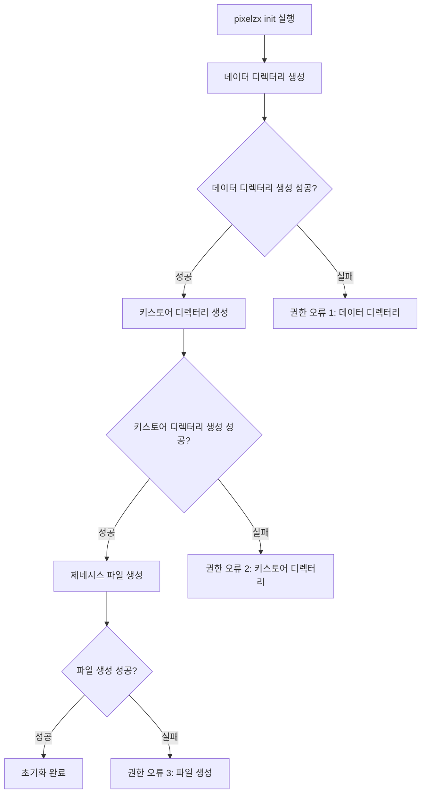
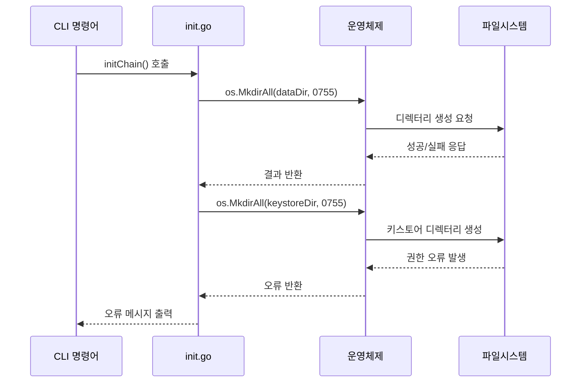
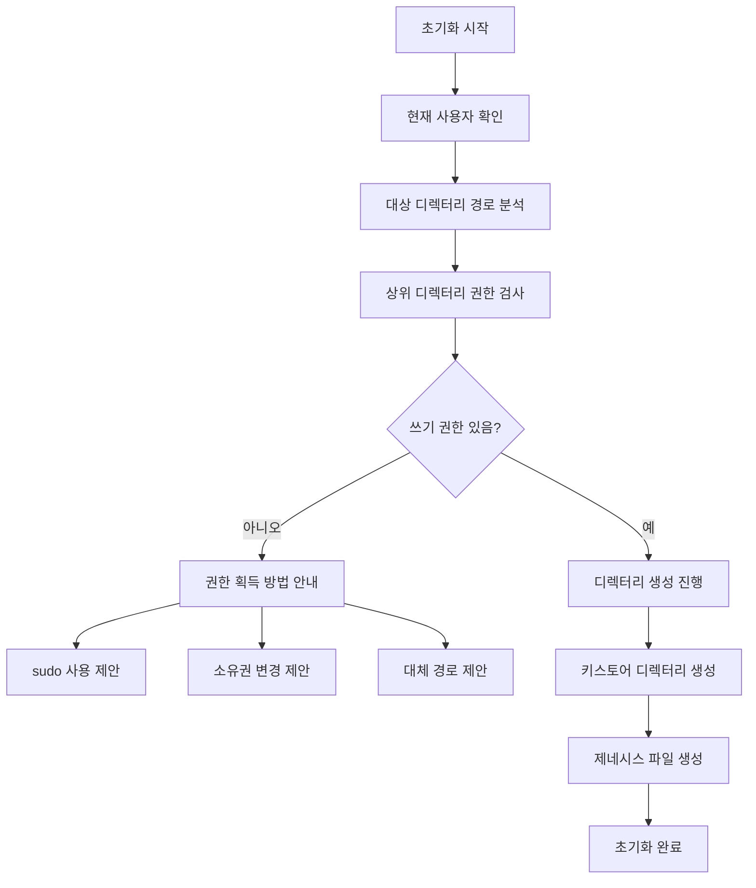
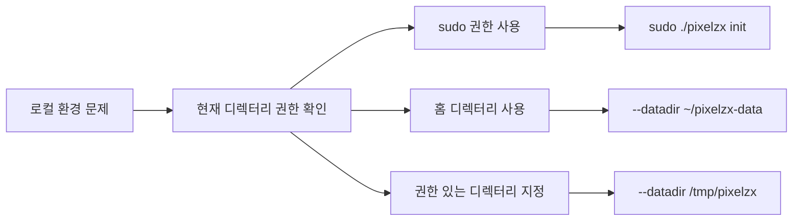
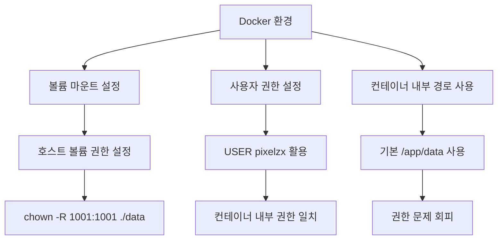
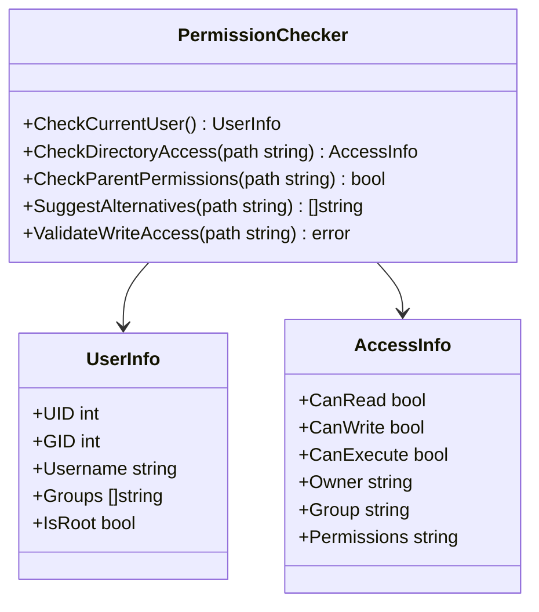
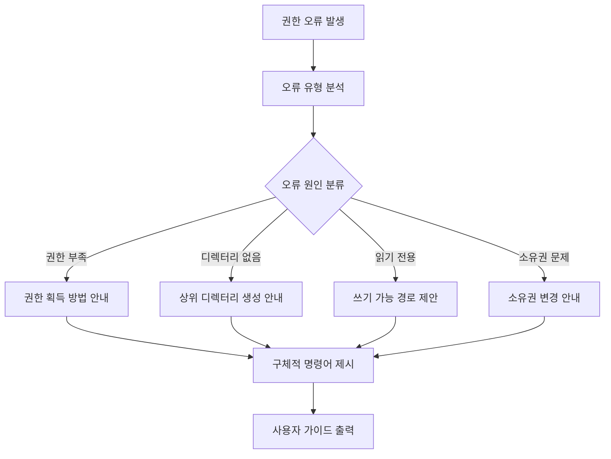
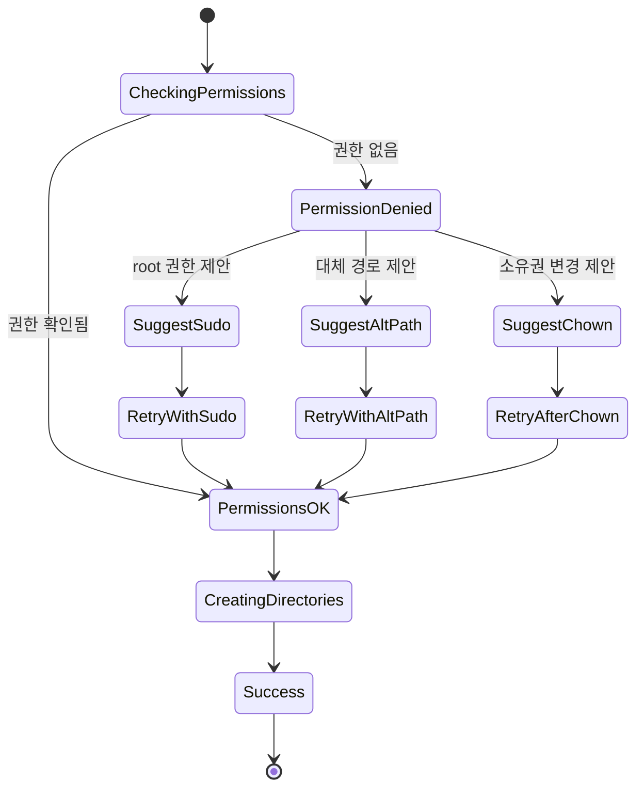

# PIXELZX POS EVM 체인 디렉토리 권한 오류 해결 설계

## 개요

PIXELZX POS EVM 체인의 `pixelzx init` 명령어 실행 시 발생하는 "permission denied" 오류를 해결하기 위한 종합적인 설계 문서입니다. 이 문서는 권한 오류의 근본 원인을 분석하고, 다양한 실행 환경(로컬, Docker, 프로덕션)에서의 해결 방안을 제시합니다.

## 문제 분석

### 오류 상황
```bash
Error: 키스토어 디렉토리 생성 실패: mkdir data/keystore: permission denied
```

### 권한 오류 발생 시나리오



### 권한 오류 원인 분류

| 원인 유형 | 발생 환경 | 구체적 원인 | 영향도 |
|----------|----------|------------|--------|
| 파일시스템 권한 | 로컬 환경 | 현재 사용자의 쓰기 권한 부족 | 높음 |
| 디렉터리 소유권 | 로컬/Docker | 디렉터리 소유자와 실행 사용자 불일치 | 높음 |
| 읽기 전용 마운트 | Docker 환경 | 볼륨이 읽기 전용으로 마운트됨 | 중간 |
| SELinux/AppArmor | 리눅스 환경 | 보안 정책에 의한 접근 제한 | 낮음 |
| 상위 디렉터리 권한 | 모든 환경 | 상위 디렉터리의 실행 권한 부족 | 중간 |

## 아키텍처 분석

### 현재 디렉터리 구조 생성 로직



### 권한 검증 부재 문제

현재 `init.go` 구현에서는 디렉터리 생성 전 권한 검증 로직이 없습니다:

```go
// 현재 구현 - 권한 검증 없이 바로 생성 시도
func initChain(dataDir, genesisPath string, chainID uint64, networkName string) error {
    // 데이터 디렉토리 생성
    if err := os.MkdirAll(dataDir, 0755); err != nil {
        return fmt.Errorf("데이터 디렉토리 생성 실패: %w", err)
    }
    
    // 키스토어 디렉토리 생성
    keystoreDir := filepath.Join(dataDir, "keystore")
    if err := os.MkdirAll(keystoreDir, 0755); err != nil {
        return fmt.Errorf("키스토어 디렉토리 생성 실패: %w", err)
    }
}
```

## 해결 방안 설계

### 1. 권한 검증 및 사전 검사 로직



### 2. 개선된 초기화 함수 설계

```go
// 개선된 초기화 함수 구조
func initChainWithPermissionCheck(dataDir, genesisPath string, chainID uint64, networkName string) error {
    // 1. 사전 권한 검증
    if err := validatePermissions(dataDir); err != nil {
        return err
    }
    
    // 2. 안전한 디렉터리 생성
    if err := createDirectorySafely(dataDir); err != nil {
        return err
    }
    
    // 3. 키스토어 디렉터리 생성
    if err := createKeystoreDirectory(dataDir); err != nil {
        return err
    }
    
    // 4. 파일 생성 및 권한 설정
    return createGenesisAndConfig(dataDir, genesisPath, chainID, networkName)
}
```

### 3. 환경별 해결 방안

#### 로컬 환경 해결 방안



#### Docker 환경 해결 방안



### 4. 다중 권한 확인 전략



### 5. 오류 메시지 개선 및 해결 가이드



## 구체적 구현 방안

### 1. 권한 검증 함수

```go
type PermissionValidator struct {
    dataDir    string
    currentUID int
    currentGID int
}

func (pv *PermissionValidator) ValidatePermissions() error {
    // 1. 현재 사용자 정보 확인
    // 2. 대상 디렉터리 접근성 검사
    // 3. 상위 디렉터리 쓰기 권한 확인
    // 4. 대안 경로 제안
}
```

### 2. 안전한 디렉터리 생성

```go
func CreateDirectorySafely(path string, perm os.FileMode) error {
    // 1. 경로 정규화
    // 2. 상위 디렉터리 존재 확인
    // 3. 권한 설정과 함께 생성
    // 4. 생성 후 권한 재확인
}
```

### 3. Docker 환경 최적화

```dockerfile
# 개선된 Dockerfile 권한 설정
FROM alpine:latest

# 사용자 생성 시 명시적 UID/GID 설정
RUN addgroup -g 1001 -S pixelzx && \
    adduser -u 1001 -S pixelzx -G pixelzx

# 디렉터리 생성 및 권한 설정 개선
RUN mkdir -p /app/data /app/keystore /app/logs && \
    chown -R 1001:1001 /app && \
    chmod -R 755 /app
```

### 4. 환경별 실행 가이드

#### 로컬 환경 실행 방법

| 방법 | 명령어 | 적용 상황 |
|------|--------|----------|
| 기본 실행 | `./pixelzx init` | 현재 디렉터리에 쓰기 권한이 있는 경우 |
| 홈 디렉터리 사용 | `./pixelzx init --datadir ~/pixelzx-data` | 현재 디렉터리 권한이 없는 경우 |
| 임시 디렉터리 사용 | `./pixelzx init --datadir /tmp/pixelzx` | 테스트 목적 |
| 관리자 권한 사용 | `sudo ./pixelzx init` | 시스템 레벨 설치 |

#### Docker 환경 실행 방법

```bash
# 호스트 볼륨 권한 설정
sudo chown -R 1001:1001 ./data

# Docker Compose 실행
docker-compose up -d

# 직접 Docker 실행
docker run -v $(pwd)/data:/app/data yuchanshin/pixelzx-evm:latest init
```

### 5. 오류 처리 및 복구 메커니즘



## 테스트 시나리오

### 1. 권한 오류 시뮬레이션 테스트

```bash
# 읽기 전용 디렉터리에서 테스트
chmod 444 ./test-readonly
./pixelzx init --datadir ./test-readonly/data

# 소유권 없는 디렉터리에서 테스트  
sudo mkdir /test-no-owner
./pixelzx init --datadir /test-no-owner/data

# 일반 사용자로 시스템 디렉터리 접근 테스트
./pixelzx init --datadir /usr/local/pixelzx
```

### 2. Docker 환경 테스트

```bash
# 권한 없는 볼륨 마운트 테스트
docker run -v /root/restricted:/app/data pixelzx init

# 올바른 권한 설정 테스트
chown -R 1001:1001 ./data
docker run -v $(pwd)/data:/app/data pixelzx init
```

### 3. 복구 시나리오 테스트

```bash
# 부분적 실패 후 복구 테스트
mkdir -p ./data
chmod 600 ./data  # 키스토어 생성 실패 유도
./pixelzx init --datadir ./data
chmod 755 ./data  # 권한 수정 후 재시도
./pixelzx init --datadir ./data
```

## 모니터링 및 로깅

### 권한 관련 로그 추가

```go
// 로그 레벨별 권한 정보 출력
func logPermissionInfo(dataDir string) {
    log.Debug("현재 사용자 UID: %d, GID: %d", os.Getuid(), os.Getgid())
    log.Debug("대상 디렉터리: %s", dataDir)
    
    if stat, err := os.Stat(filepath.Dir(dataDir)); err == nil {
        log.Debug("상위 디렉터리 권한: %s", stat.Mode().String())
    }
}
```

### 성능 메트릭

| 메트릭 | 설명 | 모니터링 방법 |
|--------|------|---------------|
| 초기화 성공률 | 권한 오류 없는 초기화 비율 | 로그 분석 |
| 평균 초기화 시간 | 권한 검사 포함 전체 시간 | 시간 측정 |
| 오류 유형 분포 | 권한 오류 원인별 분류 | 오류 로그 분석 |
| 복구 성공률 | 오류 발생 후 해결 비율 | 재시도 로그 분석 |

## 장기 개선 방안

### 1. 자동 권한 복구 기능
- 권한 오류 감지 시 자동으로 대체 경로 시도
- 사용자 동의 하에 권한 수정 제안
- Docker 환경에서 자동 볼륨 권한 설정

### 2. 설치 프로그램 통합
- 시스템 레벨 설치 시 적절한 권한 자동 설정
- 사용자별 데이터 디렉터리 자동 생성
- 환경 변수 기반 기본 경로 설정

### 3. 플랫폼별 최적화
- Windows 환경에서의 권한 처리
- macOS에서의 보안 정책 대응
- 다양한 Linux 배포판 호환성 확보