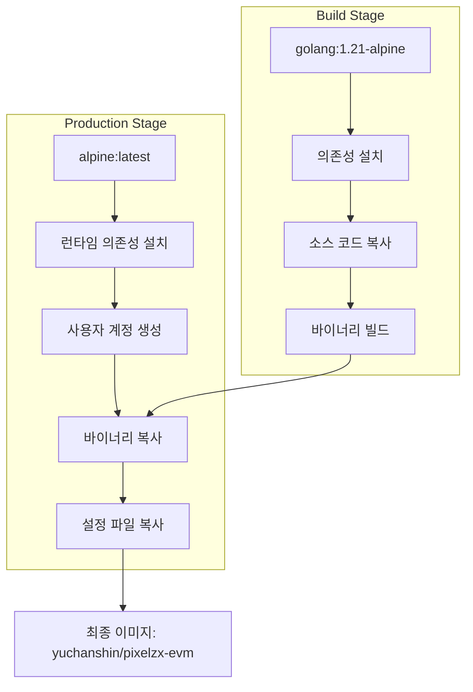
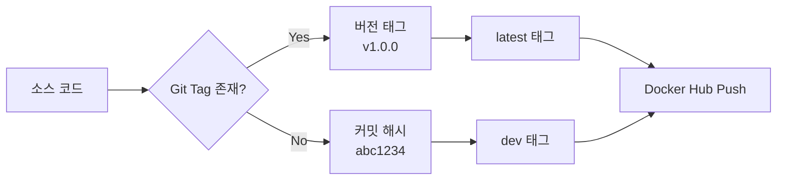
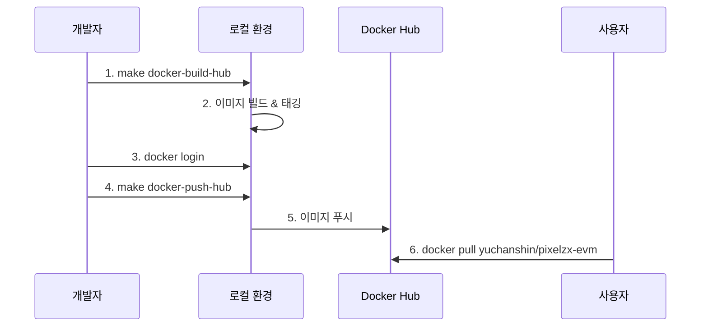
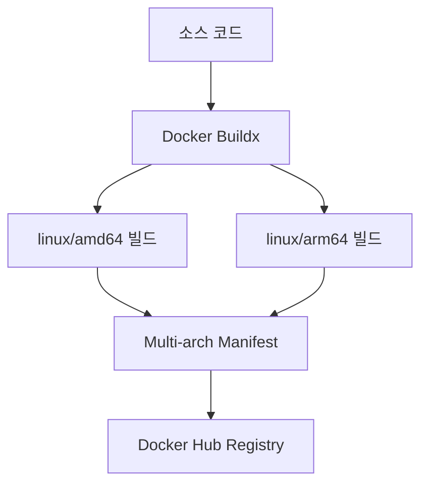
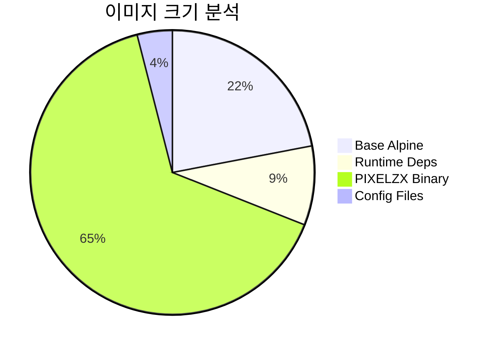
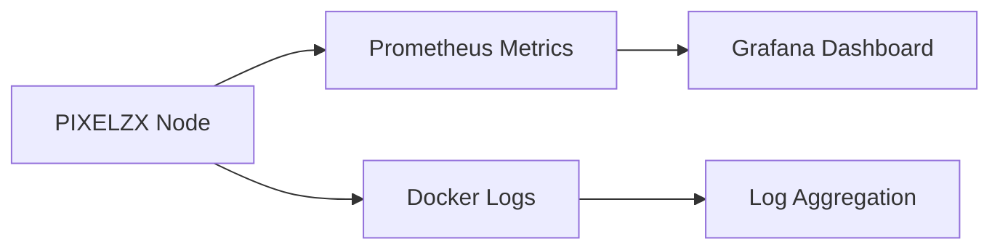
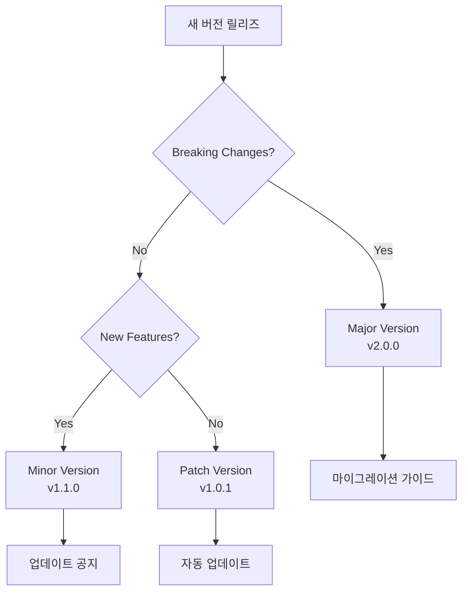

# PIXELZX POS EVM 체인 Docker Hub 배포 설계

## Overview

PIXELZX POS EVM 체인을 Docker 이미지로 빌드하여 Docker Hub의 `yuchanshin/pixelzx-evm` 저장소에 배포하기 위한 설계 문서입니다. 이를 통해 체인 노드를 쉽게 배포하고 운영할 수 있도록 합니다.

## Technology Stack & Dependencies

### 핵심 기술 스택
- **언어**: Go 1.21
- **컨테이너화**: Docker, Docker Compose
- **빌드 도구**: Makefile
- **CLI 프레임워크**: Cobra
- **이미지 레지스트리**: Docker Hub

### 런타임 의존성
- Alpine Linux (프로덕션 이미지)
- ca-certificates
- tzdata

## Architecture

### 멀티 스테이지 빌드 구조



### 이미지 레이어 구조

| 레이어 | 크기 (추정) | 설명 |
|--------|------------|------|
| Base Alpine | ~5MB | 기본 Alpine Linux 이미지 |
| Runtime Dependencies | ~2MB | ca-certificates, tzdata |
| User & Directories | <1MB | 사용자 계정 및 디렉토리 생성 |
| PIXELZX Binary | ~15MB | 컴파일된 Go 바이너리 |
| Configuration | <1MB | 프로덕션 설정 파일 |
| **Total** | **~23MB** | 최종 이미지 크기 |

## Docker 이미지 빌드 전략

### 이미지 태깅 전략



### 태그 명명 규칙
- `latest`: 최신 릴리즈 버전
- `v{major}.{minor}.{patch}`: 시맨틱 버전 (예: v1.0.0)
- `dev`: 개발 버전 (기본 브랜치)
- `{commit-hash}`: 특정 커밋 버전

## Docker Hub 배포 프로세스

### 수동 배포 프로세스



### Makefile 명령어 확장

현재 Makefile에 추가될 명령어들:

```make
# Docker Hub 관련 명령어
DOCKER_REGISTRY=yuchanshin
DOCKER_IMAGE=pixelzx-evm
DOCKER_TAG=latest

docker-build-hub:
	@echo "Building Docker image for Docker Hub..."
	docker build -t $(DOCKER_REGISTRY)/$(DOCKER_IMAGE):$(DOCKER_TAG) .
	docker build -t $(DOCKER_REGISTRY)/$(DOCKER_IMAGE):$(shell git describe --tags --always) .

docker-push-hub:
	@echo "Pushing Docker image to Docker Hub..."
	docker push $(DOCKER_REGISTRY)/$(DOCKER_IMAGE):$(DOCKER_TAG)
	docker push $(DOCKER_REGISTRY)/$(DOCKER_IMAGE):$(shell git describe --tags --always)

docker-login:
	@echo "Logging into Docker Hub..."
	docker login

docker-deploy-hub: docker-build-hub docker-push-hub
	@echo "Docker Hub deployment completed!"
```

### 자동화된 CI/CD 파이프라인 (GitHub Actions)

```yaml
# .github/workflows/docker-hub-deploy.yml
name: Docker Hub Deploy

on:
  push:
    tags:
      - 'v*'
  workflow_dispatch:

jobs:
  docker-hub-deploy:
    runs-on: ubuntu-latest
    steps:
      - name: Checkout
        uses: actions/checkout@v4
      
      - name: Docker Meta
        id: meta
        uses: docker/metadata-action@v5
        with:
          images: yuchanshin/pixelzx-evm
          tags: |
            type=ref,event=tag
            type=raw,value=latest,enable={{is_default_branch}}
      
      - name: Login to Docker Hub
        uses: docker/login-action@v3
        with:
          username: ${{ secrets.DOCKER_HUB_USERNAME }}
          password: ${{ secrets.DOCKER_HUB_TOKEN }}
      
      - name: Build and Push
        uses: docker/build-push-action@v5
        with:
          context: .
          push: true
          tags: ${{ steps.meta.outputs.tags }}
          labels: ${{ steps.meta.outputs.labels }}
```

## 이미지 최적화 전략

### 멀티 아키텍처 빌드



### 보안 최적화

| 보안 요소 | 구현 방법 | 설명 |
|-----------|-----------|------|
| 비루트 사용자 | pixelzx:1001 | 컨테이너 실행을 위한 전용 사용자 |
| 최소 이미지 | Alpine Linux | 불필요한 패키지 제거 |
| 취약점 스캔 | Trivy/Snyk | CI/CD에서 자동 스캔 |
| 서명 검증 | Docker Content Trust | 이미지 무결성 보장 |

### 크기 최적화



## 배포 환경별 설정

### 프로덕션 환경

```yaml
# docker-compose.production.yml
version: '3.8'
services:
  pixelzx-node:
    image: yuchanshin/pixelzx-evm:latest
    container_name: pixelzx-mainnet
    restart: unless-stopped
    ports:
      - "8545:8545"
      - "8546:8546"
      - "30303:30303"
    volumes:
      - pixelzx-data:/app/data
      - pixelzx-keystore:/app/keystore
    environment:
      - PIXELZX_CHAIN_ID=8888
      - PIXELZX_NETWORK=mainnet
```

### 개발 환경

```yaml
# docker-compose.development.yml
version: '3.8'
services:
  pixelzx-node:
    image: yuchanshin/pixelzx-evm:dev
    container_name: pixelzx-devnet
    ports:
      - "8545:8545"
      - "8546:8546"
      - "30303:30303"
    environment:
      - PIXELZX_CHAIN_ID=7777
      - PIXELZX_NETWORK=devnet
```

## 사용자 배포 가이드

### 빠른 시작

```bash
# 1. 이미지 다운로드
docker pull yuchanshin/pixelzx-evm:latest

# 2. 컨테이너 실행
docker run -d \
  --name pixelzx-node \
  -p 8545:8545 \
  -p 8546:8546 \
  -p 30303:30303 \
  -v pixelzx-data:/app/data \
  -v pixelzx-keystore:/app/keystore \
  -e PIXELZX_CHAIN_ID=8888 \
  yuchanshin/pixelzx-evm:latest

# 3. 로그 확인
docker logs -f pixelzx-node
```

### Docker Compose 사용

```bash
# 1. compose 파일 다운로드
wget https://raw.githubusercontent.com/pixelzx/pos/main/docker-compose.production.yml

# 2. 서비스 시작
docker-compose -f docker-compose.production.yml up -d

# 3. 상태 확인
docker-compose -f docker-compose.production.yml ps
```

## 모니터링 및 관리

### 헬스체크 구성

```dockerfile
HEALTHCHECK --interval=30s --timeout=10s --start-period=5s --retries=3 \
    CMD pixelzx version || exit 1
```

### 로그 관리

```yaml
logging:
  driver: "json-file"
  options:
    max-size: "100m"
    max-file: "5"
```

### 메트릭스 수집



## 버전 관리 및 업데이트

### 업데이트 전략



### 롤백 전략

| 시나리오 | 롤백 방법 | 복구 시간 |
|----------|-----------|----------|
| 이미지 오류 | 이전 태그로 변경 | ~2분 |
| 설정 오류 | 볼륨 복원 | ~5분 |
| 데이터 손상 | 백업에서 복원 | ~30분 |

## Testing

### 이미지 테스트 전략

```bash
# 1. 이미지 빌드 테스트
make docker-build-hub

# 2. 기본 실행 테스트
docker run --rm yuchanshin/pixelzx-evm:latest pixelzx version

# 3. 헬스체크 테스트
docker run --rm --health-cmd="pixelzx version" \
  yuchanshin/pixelzx-evm:latest

# 4. 포트 바인딩 테스트
docker run -d -p 8545:8545 --name test-node \
  yuchanshin/pixelzx-evm:latest
curl http://localhost:8545
docker rm -f test-node
```

### 자동화된 테스트

```yaml
# GitHub Actions 테스트
- name: Test Docker Image
  run: |
    docker run --rm yuchanshin/pixelzx-evm:latest pixelzx version
    docker run -d --name test-node -p 8545:8545 yuchanshin/pixelzx-evm:latest
    sleep 10
    curl -f http://localhost:8545 || exit 1
    docker rm -f test-node
```- `{commit-hash}`: 특정 커밋 버전

## Docker Hub 배포 프로세스

### 수동 배포 프로세스


### Makefile 명령어 확장

현재 Makefile에 추가될 명령어들:

```make
# Docker Hub 관련 명령어
DOCKER_REGISTRY=yuchanshin
DOCKER_IMAGE=pixelzx-evm
DOCKER_TAG=latest

docker-build-hub:
	@echo "Building Docker image for Docker Hub..."
	docker build -t $(DOCKER_REGISTRY)/$(DOCKER_IMAGE):$(DOCKER_TAG) .
	docker build -t $(DOCKER_REGISTRY)/$(DOCKER_IMAGE):$(shell git describe --tags --always) .

docker-push-hub:
	@echo "Pushing Docker image to Docker Hub..."
	docker push $(DOCKER_REGISTRY)/$(DOCKER_IMAGE):$(DOCKER_TAG)
	docker push $(DOCKER_REGISTRY)/$(DOCKER_IMAGE):$(shell git describe --tags --always)

docker-login:
	@echo "Logging into Docker Hub..."
	docker login

docker-deploy-hub: docker-build-hub docker-push-hub
	@echo "Docker Hub deployment completed!"
```

### 자동화된 CI/CD 파이프라인 (GitHub Actions)

```yaml
# .github/workflows/docker-hub-deploy.yml
name: Docker Hub Deploy

on:
  push:
    tags:
      - 'v*'
  workflow_dispatch:

jobs:
  docker-hub-deploy:
    runs-on: ubuntu-latest
    steps:
      - name: Checkout
        uses: actions/checkout@v4
      
      - name: Docker Meta
        id: meta
        uses: docker/metadata-action@v5
        with:
          images: yuchanshin/pixelzx-evm
          tags: |
            type=ref,event=tag
            type=raw,value=latest,enable={{is_default_branch}}
      
      - name: Login to Docker Hub
        uses: docker/login-action@v3
        with:
          username: ${{ secrets.DOCKER_HUB_USERNAME }}
          password: ${{ secrets.DOCKER_HUB_TOKEN }}
      
      - name: Build and Push
        uses: docker/build-push-action@v5
        with:
          context: .
          push: true
          tags: ${{ steps.meta.outputs.tags }}
          labels: ${{ steps.meta.outputs.labels }}
```

## 이미지 최적화 전략

### 멀티 아키텍처 빌드


### 보안 최적화

| 보안 요소 | 구현 방법 | 설명 |
|-----------|-----------|------|
| 비루트 사용자 | pixelzx:1001 | 컨테이너 실행을 위한 전용 사용자 |
| 최소 이미지 | Alpine Linux | 불필요한 패키지 제거 |
| 취약점 스캔 | Trivy/Snyk | CI/CD에서 자동 스캔 |
| 서명 검증 | Docker Content Trust | 이미지 무결성 보장 |

### 크기 최적화


## 배포 환경별 설정

### 프로덕션 환경

```yaml
# docker-compose.production.yml
version: '3.8'
services:
  pixelzx-node:
    image: yuchanshin/pixelzx-evm:latest
    container_name: pixelzx-mainnet
    restart: unless-stopped
    ports:
      - "8545:8545"
      - "8546:8546"
      - "30303:30303"
    volumes:
      - pixelzx-data:/app/data
      - pixelzx-keystore:/app/keystore
    environment:
      - PIXELZX_CHAIN_ID=8888
      - PIXELZX_NETWORK=mainnet
```

### 개발 환경

```yaml
# docker-compose.development.yml
version: '3.8'
services:
  pixelzx-node:
    image: yuchanshin/pixelzx-evm:dev
    container_name: pixelzx-devnet
    ports:
      - "8545:8545"
      - "8546:8546"
      - "30303:30303"
    environment:
      - PIXELZX_CHAIN_ID=7777
      - PIXELZX_NETWORK=devnet
```

## 사용자 배포 가이드

### 빠른 시작

```bash
# 1. 이미지 다운로드
docker pull yuchanshin/pixelzx-evm:latest

# 2. 컨테이너 실행
docker run -d \
  --name pixelzx-node \
  -p 8545:8545 \
  -p 8546:8546 \
  -p 30303:30303 \
  -v pixelzx-data:/app/data \
  -v pixelzx-keystore:/app/keystore \
  -e PIXELZX_CHAIN_ID=8888 \
  yuchanshin/pixelzx-evm:latest

# 3. 로그 확인
docker logs -f pixelzx-node
```

### Docker Compose 사용

```bash
# 1. compose 파일 다운로드
wget https://raw.githubusercontent.com/pixelzx/pos/main/docker-compose.production.yml

# 2. 서비스 시작
docker-compose -f docker-compose.production.yml up -d

# 3. 상태 확인
docker-compose -f docker-compose.production.yml ps
```

## 모니터링 및 관리

### 헬스체크 구성

```dockerfile
HEALTHCHECK --interval=30s --timeout=10s --start-period=5s --retries=3 \
    CMD pixelzx version || exit 1
```

### 로그 관리

```yaml
logging:
  driver: "json-file"
  options:
    max-size: "100m"
    max-file: "5"
```

### 메트릭스 수집


## 버전 관리 및 업데이트

### 업데이트 전략


### 롤백 전략

| 시나리오 | 롤백 방법 | 복구 시간 |
|----------|-----------|----------|
| 이미지 오류 | 이전 태그로 변경 | ~2분 |
| 설정 오류 | 볼륨 복원 | ~5분 |
| 데이터 손상 | 백업에서 복원 | ~30분 |

## Testing

### 이미지 테스트 전략

```bash
# 1. 이미지 빌드 테스트
make docker-build-hub

# 2. 기본 실행 테스트
docker run --rm yuchanshin/pixelzx-evm:latest pixelzx version

# 3. 헬스체크 테스트
docker run --rm --health-cmd="pixelzx version" \
  yuchanshin/pixelzx-evm:latest

# 4. 포트 바인딩 테스트
docker run -d -p 8545:8545 --name test-node \
  yuchanshin/pixelzx-evm:latest
curl http://localhost:8545
docker rm -f test-node
```

### 자동화된 테스트

```yaml
# GitHub Actions 테스트
- name: Test Docker Image
  run: |
    docker run --rm yuchanshin/pixelzx-evm:latest pixelzx version
    docker run -d --name test-node -p 8545:8545 yuchanshin/pixelzx-evm:latest
    sleep 10
    curl -f http://localhost:8545 || exit 1
    docker rm -f test-node
```


