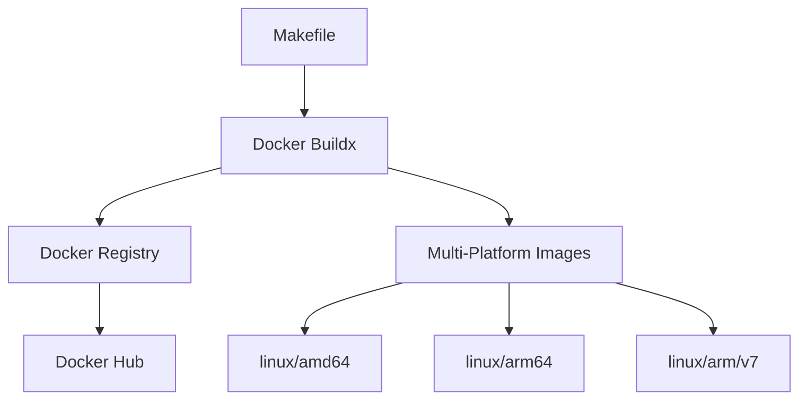

# Docker 이미지 빌드 및 푸시 시스템 디자인

## 1. 개요

PIXELZX POS EVM 체인은 멀티 아키텍처를 지원하는 Docker 이미지를 빌드하고 Docker Hub에 푸시하는 시스템을 구현합니다. 이 시스템은 다양한 플랫폼(linux/amd64, linux/arm64, linux/arm/v7)에서 실행 가능한 컨테이너 이미지를 생성하고 배포합니다.

## 2. 아키텍처

### 2.1 구성 요소



### 2.2 주요 기술 스택

- **Docker Buildx**: 멀티 플랫폼 이미지 빌드 도구
- **Docker Hub**: 이미지 저장소
- **Alpine Linux**: 경량 베이스 이미지
- **Go 1.21**: 블록체인 애플리케이션 개발 언어

## 3. 빌드 및 푸시 프로세스

### 3.1 빌드 단계

1. **Buildx 초기화**
   - Buildx 빌더 인스턴스 생성
   - 멀티 플랫폼 빌드 준비

2. **크로스 컴파일**
   - Go 애플리케이션을 다양한 아키텍처용으로 컴파일
   - CGO 비활성화로 정적 바이너리 생성

3. **이미지 생성**
   - Alpine Linux 베이스 이미지 사용
   - 보안을 위한 non-root 사용자 설정
   - 필요한 런타임 의존성 설치

### 3.2 푸시 단계

1. **태그 생성**
   - latest 태그
   - 버전 태그 (Git 태그 기반)
   
2. **멀티 아키텍처 매니페스트**
   - 각 플랫폼 이미지에 대한 참조 생성
   - 매니페스트 리스트를 Docker Hub에 푸시

## 4. Dockerfile 구조

### 4.1 멀티 스테이지 빌드

```dockerfile
# 빌드 스테이지
FROM --platform=$BUILDPLATFORM golang:1.21-alpine AS builder
# 크로스 컴파일 환경 설정
# 소스 코드 컴파일

# 프로덕션 스테이지
FROM alpine:latest
# 런타임 의존성 설치
# 빌드 스테이지에서 바이너리 복사
# 보안 설정 및 환경 변수 정의
```

### 4.2 보안 구성

- Non-root 사용자(pixelzx)로 실행
- 필요한 최소한의 권한만 부여
- 볼륨 마운트를 위한 적절한 디렉토리 권한 설정

## 5. Makefile 명령어

### 5.1 주요 명령어

| 명령어 | 설명 |
|--------|------|
| `make docker-build-multi` | 멀티 플랫폼 이미지 빌드 |
| `make docker-push-multi` | 멀티 플랫폼 이미지 푸시 |
| `make docker-deploy-multi` | 빌드, 푸시, 테스트 통합 실행 |
| `make buildx-setup` | Buildx 환경 설정 |

### 5.2 환경 변수

| 변수명 | 기본값 | 설명 |
|--------|--------|------|
| `DOCKER_REGISTRY` | yuchanshin | Docker Hub 사용자명 |
| `DOCKER_IMAGE` | pixelzx-evm | 이미지 이름 |
| `PLATFORMS` | linux/amd64,linux/arm64,linux/arm/v7 | 지원 플랫폼 목록 |

## 6. 테스트 및 검증

### 6.1 플랫폼별 테스트

각 아키텍처에서 이미지가 정상적으로 실행되는지 검증:

```bash
# AMD64 테스트
docker run --rm --platform linux/amd64 yuchanshin/pixelzx-evm:latest /usr/local/bin/pixelzx version

# ARM64 테스트
docker run --rm --platform linux/arm64 yuchanshin/pixelzx-evm:latest /usr/local/bin/pixelzx version
```

### 6.2 기능 테스트

- CLI 명령어 정상 작동 확인
- 버전 정보 출력 테스트
- 초기화 및 시작 명령어 테스트

## 7. 문제 해결

### 7.1 Exec Format Error

**문제**: 아키텍처 불일치로 인한 실행 오류

**해결**: 
- 플랫폼 명시적 지정: `--platform` 옵션 사용
- Buildx를 통한 올바른 크로스 컴파일 확인

### 7.2 권한 문제

**문제**: 컨테이너 내부에서 파일 접근 권한 부족

**해결**:
- Dockerfile 내에서 적절한 권한 설정
- 볼륨 마운트 시 UID/GID 일치 확인