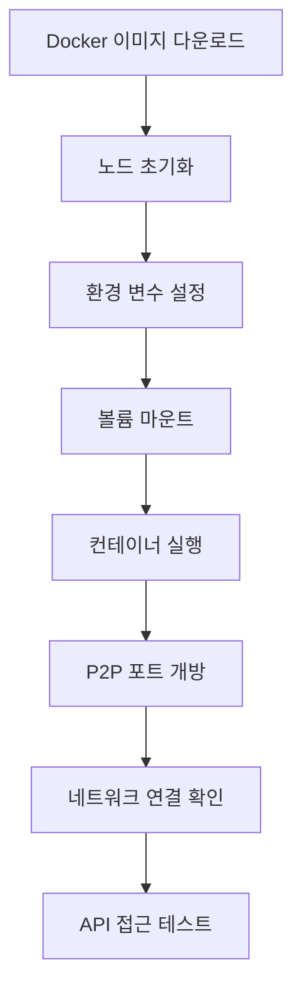
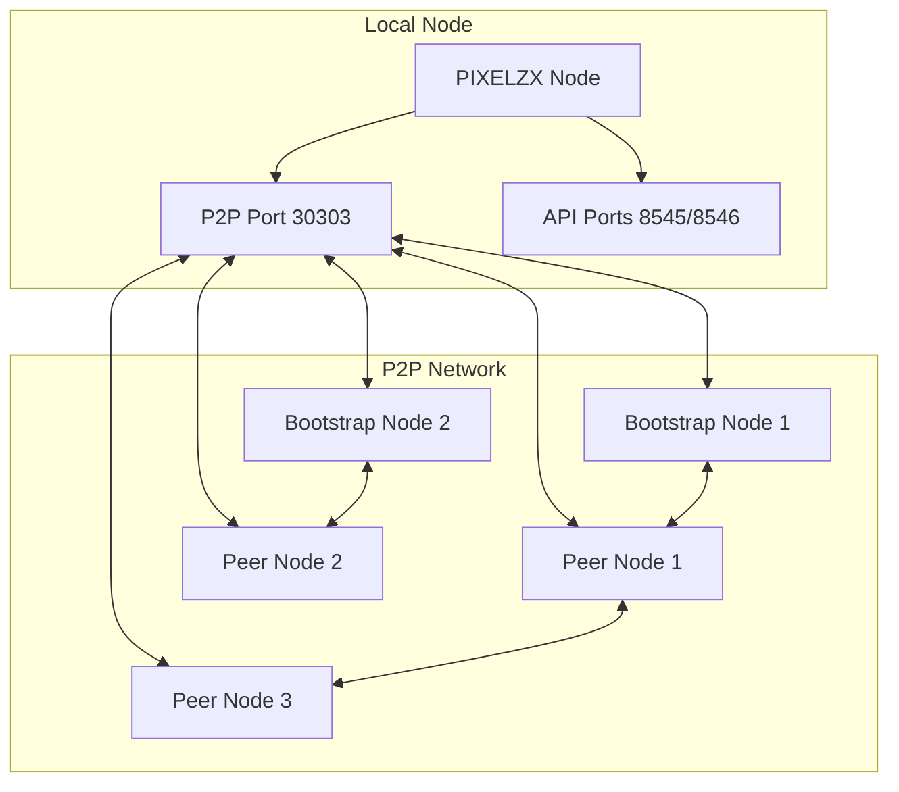
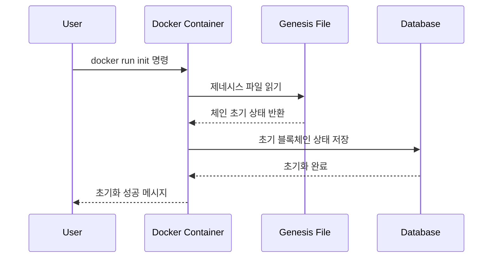

# Docker 초기 설정 및 P2P 연결 방법 가이드 추가 설계

## 개요

PIXELZX POS EVM 체인의 README.md 파일에 Docker 초기 설정과 P2P 연결 방법에 대한 상세한 가이드를 추가하여 사용자들이 쉽게 노드를 설정하고 네트워크에 연결할 수 있도록 지원합니다.

## 기술 스택

- **프로젝트**: PIXELZX POS EVM Chain (Go 기반)
- **컨테이너화**: Docker & Docker Compose
- **네트워킹**: P2P 프로토콜 (포트 30303)
- **API**: JSON-RPC (포트 8545), WebSocket (포트 8546)
- **배포**: Docker Hub (yuchanshin/pixelzx-evm)

## 추가할 섹션 구조

### 1. Docker 빠른 시작 섹션
- 기본 Docker 실행 명령어
- 환경 변수 설정
- 볼륨 마운트 가이드
- 헬스체크 방법

### 2. P2P 네트워크 연결 섹션
- P2P 포트 설정 (30303)
- 부트노드 연결
- 피어 발견 과정
- 네트워크 상태 확인

### 3. 노드 초기화 및 설정 섹션
- 제네시스 파일 초기화
- 설정 파일 커스터마이징
- 키스토어 관리
- 데이터 디렉토리 설정

## 새로 추가할 내용

### Docker 빠른 시작 가이드



#### 기본 Docker 명령어
```bash
# 1. 이미지 다운로드
docker pull yuchanshin/pixelzx-evm:latest

# 2. 노드 초기화 (선택사항)
docker run --rm \
  -v pixelzx-data:/app/data \
  yuchanshin/pixelzx-evm:latest \
  pixelzx init --datadir /app/data

# 3. 노드 실행
docker run -d \
  --name pixelzx-node \
  -p 8545:8545 \
  -p 8546:8546 \
  -p 30303:30303 \
  -v pixelzx-data:/app/data \
  -v pixelzx-keystore:/app/keystore \
  yuchanshin/pixelzx-evm:latest
```

#### 환경 변수 설정표
| 변수명 | 기본값 | 설명 | 예시 |
|--------|--------|------|------|
| PIXELZX_CHAIN_ID | 8888 | 체인 ID | 8888 (메인넷), 8889 (테스트넷) |
| PIXELZX_NETWORK | mainnet | 네트워크 타입 | mainnet, testnet, devnet |
| PIXELZX_P2P_PORT | 30303 | P2P 통신 포트 | 30303 |
| PIXELZX_RPC_PORT | 8545 | JSON-RPC API 포트 | 8545 |
| PIXELZX_WS_PORT | 8546 | WebSocket API 포트 | 8546 |

### P2P 네트워크 연결 가이드

#### 네트워크 아키텍처


#### P2P 연결 설정 방법

1. **기본 P2P 설정**
```bash
# P2P 포트 확인
docker exec pixelzx-node netstat -tulpn | grep 30303

# 방화벽 설정 (Ubuntu/Debian)
sudo ufw allow 30303/tcp
sudo ufw allow 30303/udp
```

2. **부트노드 연결**
```bash
# 부트노드 목록 확인
docker exec pixelzx-node pixelzx admin peers

# 수동으로 피어 추가
docker exec pixelzx-node pixelzx admin addPeer "enode://[PEER_ID]@[IP]:[PORT]"
```

3. **네트워크 상태 모니터링**
```bash
# 연결된 피어 수 확인
docker exec pixelzx-node pixelzx admin peerCount

# 네트워크 정보 확인
docker exec pixelzx-node pixelzx admin nodeInfo

# 블록 동기화 상태 확인
docker exec pixelzx-node pixelzx eth syncing
```

#### P2P 연결 트러블슈팅

| 문제 | 원인 | 해결방법 |
|------|------|----------|
| 피어 연결 실패 | 방화벽 차단 | 포트 30303 개방 |
| 느린 동기화 | 부트노드 응답 없음 | 다른 부트노드 시도 |
| NAT 문제 | 공인 IP 없음 | --nat 옵션 사용 |

### 노드 초기화 및 설정

#### 제네시스 파일 초기화 과정


#### 단계별 초기화 가이드

1. **데이터 디렉토리 준비**
```bash
# Docker 볼륨 생성
docker volume create pixelzx-data
docker volume create pixelzx-keystore

# 볼륨 위치 확인
docker volume inspect pixelzx-data
```

2. **제네시스 초기화**
```bash
# 메인넷 초기화
docker run --rm \
  -v pixelzx-data:/app/data \
  yuchanshin/pixelzx-evm:latest \
  pixelzx init --chain-id 8888

# 테스트넷 초기화
docker run --rm \
  -v pixelzx-data:/app/data \
  yuchanshin/pixelzx-evm:latest \
  pixelzx init --chain-id 8889 --network testnet
```

3. **설정 파일 커스터마이징**
```bash
# 기본 설정 파일 추출
docker run --rm \
  -v $(pwd):/backup \
  yuchanshin/pixelzx-evm:latest \
  cp /app/configs/production.yaml /backup/

# 커스텀 설정으로 실행
docker run -d \
  --name pixelzx-custom \
  -v $(pwd)/production.yaml:/app/configs/production.yaml \
  -v pixelzx-data:/app/data \
  yuchanshin/pixelzx-evm:latest
```

## README.md 수정 계획

### 추가할 위치
기존 "빌드 및 실행" 섹션을 확장하여 다음 순서로 재구성:

1. **빌드 및 실행** (기존 내용 유지)
2. **Docker 빠른 시작** (신규 추가)
3. **P2P 네트워크 연결** (신규 추가)  
4. **노드 초기화 및 설정** (신규 추가)
5. **API 엔드포인트** (기존 내용 유지)

### 기존 Docker 실행 부분 개선
- 더 상세한 명령어 설명 추가
- 환경 변수 표 추가
- 볼륨 설정 가이드 추가
- 트러블슈팅 섹션 강화

### 새로운 섹션별 내용

#### "Docker 빠른 시작" 섹션
- 기본 Docker 명령어
- 환경 변수 설정
- 볼륨 마운트 가이드
- 기본 헬스체크

#### "P2P 네트워크 연결" 섹션  
- P2P 포트 설정 방법
- 부트노드 연결 가이드
- 피어 상태 모니터링
- 네트워크 트러블슈팅

#### "노드 초기화 및 설정" 섹션
- 제네시스 파일 초기화
- 데이터 디렉토리 설정
- 설정 파일 커스터마이징
- 키스토어 관리

## 기대 효과

### 사용자 경험 개선
- 초보 사용자도 쉽게 노드 설정 가능
- 단계별 가이드로 실수 방지
- 트러블슈팅 정보로 문제 해결 시간 단축

### 개발자 생산성 향상
- Docker 명령어 참조 시간 단축
- P2P 연결 문제 디버깅 효율성 증대
- 표준화된 설정 절차 제공

### 커뮤니티 성장 지원
- 진입 장벽 낮춤
- 네트워크 참여 노드 수 증가
- 개발자 온보딩 프로세스 개선

## 검증 기준

### 기능 검증
- [ ] Docker 명령어 실행 성공
- [ ] P2P 연결 정상 작동
- [ ] API 엔드포인트 접근 가능
- [ ] 블록 동기화 정상 진행

### 문서 품질 검증
- [ ] 단계별 실행 가능
- [ ] 에러 상황 해결 가능
- [ ] 초보자 이해 가능
- [ ] 코드 예시 정상 작동