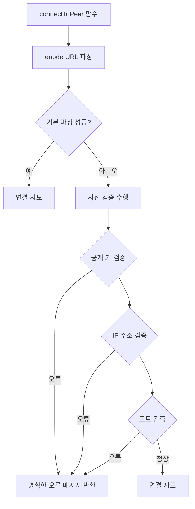

# Enode URL 검증 개선 설계 문서

## 1. 개요

PIXELZX POS EVM 체인에서 `pixelzx admin peer connect` 명령어를 사용할 때 발생하는 "invalid enode URL: invalid public key (encoding/hex: odd length hex string)" 오류를 해결하기 위한 설계 문서입니다.

이 오류는 사용자가 잘못된 형식의 enode URL을 입력했을 때 발생하며, 특히 공개 키(public key) 부분의 16진수(hexadecimal) 문자열이 홀수 길이를 가질 경우 나타납니다.

## 2. 문제 분석

### 2.1 현재 구현 상태

현재 PIXELZX POS EVM 체인의 `admin_peer.go` 파일에서 enode URL 검증은 다음과 같이 구현되어 있습니다:

```go
func connectToPeer(enodeURL string) error {
    // In a real implementation, this would use the network manager to connect to a peer
    // For now, we'll just validate the enode URL and show a message
    
    _, err := enode.Parse(enode.ValidSchemes, enodeURL)
    if err != nil {
        return fmt.Errorf("invalid enode URL: %w", err)
    }
    
    fmt.Printf("피어에 연결 시도 중: %s\n", enodeURL)
    fmt.Printf("연결이 성공적으로 시작되었습니다.\n")
    
    return nil
}
```

이 구현은 Ethereum의 `enode.Parse` 함수를 직접 사용하여 enode URL을 검증하고 있습니다.

### 2.2 오류 원인

오류 메시지 "invalid public key (encoding/hex: odd length hex string)"는 Ethereum의 enode 파싱 라이브러리에서 발생하는 것으로, 공개 키가 다음과 같은 경우에 발생합니다:

1. 공개 키의 16진수 문자열 길이가 홀수인 경우 (예: 127자)
2. 공개 키의 16진수 문자열이 올바른 형식이 아닌 경우
3. 공개 키 길이가 표준 길이(128자)가 아닌 경우

### 2.3 Enode URL 형식

표준 Ethereum enode URL 형식은 다음과 같습니다:
```
enode://<128자 16진수 공개 키>@<IP 주소>:<포트>
```

예시:
```
enode://9a8b7c6d5e4f3e2d1c0b9a8b7c6d5e4f3e2d1c0b9a8b7c6d5e4f3e2d1c0b9a8b7@192.168.35.31:30303
```

## 3. 개선 방안

### 3.1 검증 로직 강화

사용자 경험 향상을 위해, enode URL의 공개 키 부분에 대한 사전 검증을 추가하여 보다 명확한 오류 메시지를 제공합니다.

#### 3.1.1 공개 키 검증

1. 공개 키가 16진수 문자열인지 확인
2. 공개 키 길이가 128자(64바이트)인지 확인
3. 공개 키가 홀수 길이가 아닌지 확인

#### 3.1.2 IP 주소 및 포트 검증

1. IP 주소 형식이 올바른지 확인
2. 포트 번호가 유효한 범위(1-65535)인지 확인

### 3.2 오류 메시지 개선

보다 사용자 친화적인 오류 메시지를 제공하여 문제 해결을 용이하게 합니다:

1. 공개 키 길이 오류: "공개 키는 128자 길이의 16진수 문자열이어야 합니다"
2. 공개 키 형식 오류: "공개 키는 16진수 문자열이어야 합니다"
3. IP 주소 형식 오류: "IP 주소 형식이 올바르지 않습니다"
4. 포트 번호 오류: "포트 번호는 1-65535 범위의 숫자여야 합니다"

## 4. 설계

### 4.1 아키텍처



### 4.2 구현 계획

1. `admin_peer.go` 파일에 enode URL 사전 검증 함수 추가
2. 공개 키, IP 주소, 포트에 대한 개별 검증 함수 구현
3. 사용자 친화적인 오류 메시지 생성
4. 기존 `connectToPeer` 함수에 검증 로직 통합

## 5. API 및 데이터 모델

### 5.1 검증 함수 정의

```go
// validateEnodeURL performs detailed validation of an enode URL
func validateEnodeURL(enodeURL string) error {
    // Implementation details
}

// validatePublicKey validates the public key part of an enode URL
func validatePublicKey(publicKey string) error {
    // Implementation details
}

// validateIP validates the IP address part of an enode URL
func validateIP(ip string) error {
    // Implementation details
}

// validatePort validates the port part of an enode URL
func validatePort(port string) error {
    // Implementation details
}
```

### 5.2 오류 메시지 정의

| 오류 유형 | 메시지 |
|-----------|--------|
| 공개 키 길이 오류 | "공개 키는 128자 길이의 16진수 문자열이어야 합니다 (현재 길이: %d)" |
| 공개 키 형식 오류 | "공개 키는 16진수 문자열이어야 합니다" |
| IP 주소 형식 오류 | "IP 주소 형식이 올바르지 않습니다: %s" |
| 포트 번호 오류 | "포트 번호는 1-65535 범위의 숫자여야 합니다: %s" |

## 6. 테스트 계획

### 6.1 단위 테스트

1. 올바른 enode URL 형식 테스트
2. 잘못된 공개 키 길이 테스트 (홀수 길이 포함)
3. 잘못된 공개 키 형식 테스트 (16진수 아닌 문자 포함)
4. 잘못된 IP 주소 형식 테스트
5. 잘못된 포트 번호 테스트

### 6.2 통합 테스트

1. `pixelzx admin peer connect` 명령어를 통한 실제 연결 테스트
2. 다양한 오류 상황에서의 오류 메시지 출력 테스트

## 7. 보안 고려사항

1. 입력 검증을 통해 악의적인 입력으로 인한 보안 취약점 방지
2. 오류 메시지를 통해 내부 구현 정보가 노출되지 않도록 주의

## 8. 성능 고려사항

1. 사전 검증 로직이 전체 연결 프로세스의 성능에 미치는 영향 최소화
2. 검증 함수의 효율성 확보

## 9. 배포 및 마이그레이션

기존 코드에 검증 로직만 추가되므로 특별한 마이그레이션은 필요하지 않습니다. 새 버전으로 업데이트하면 기능이 자동으로 적용됩니다.