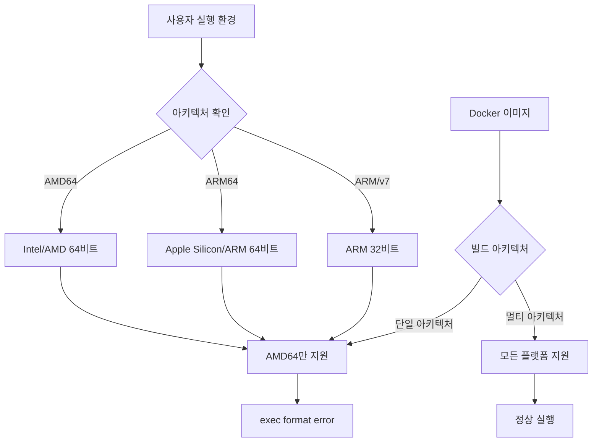
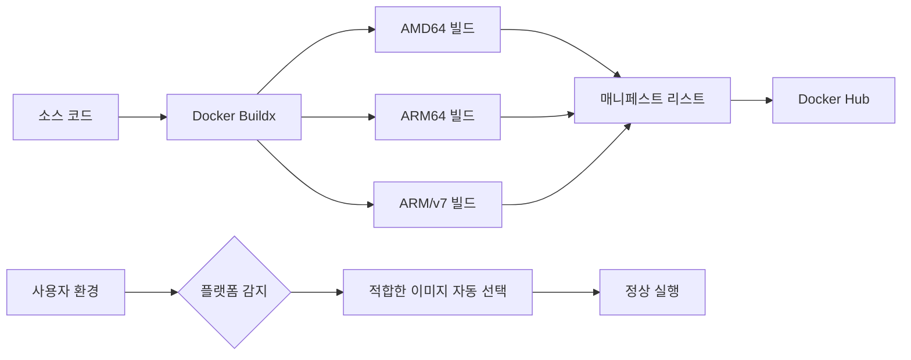
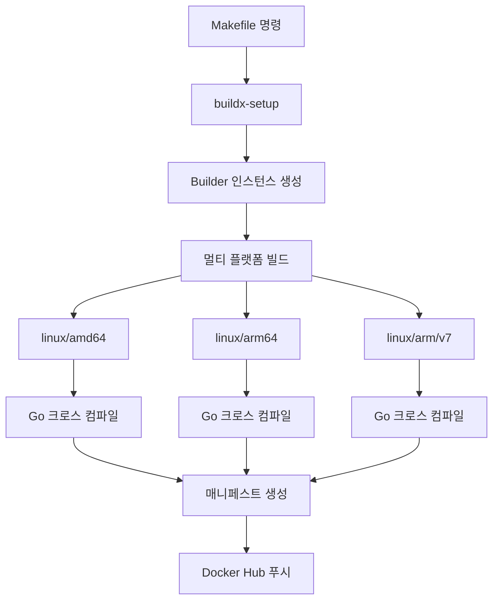
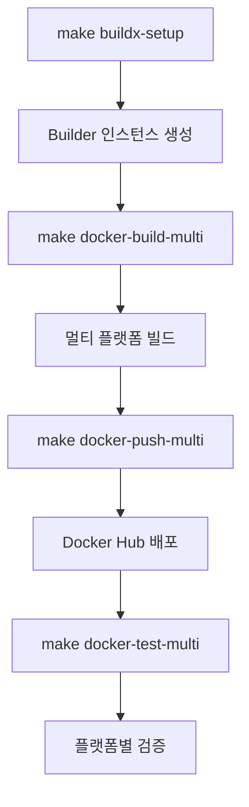
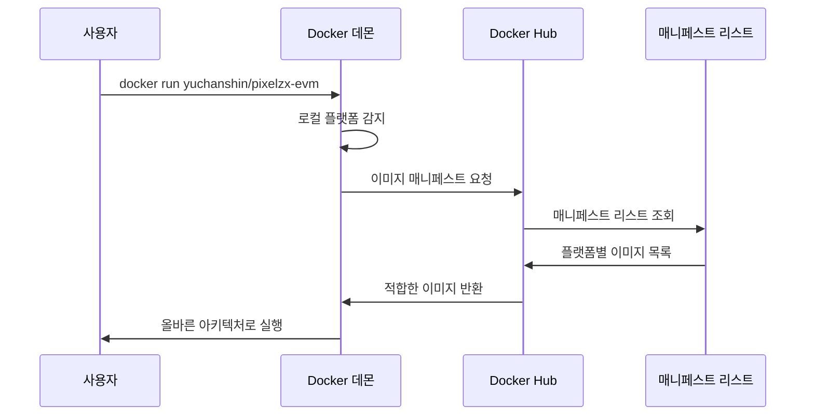
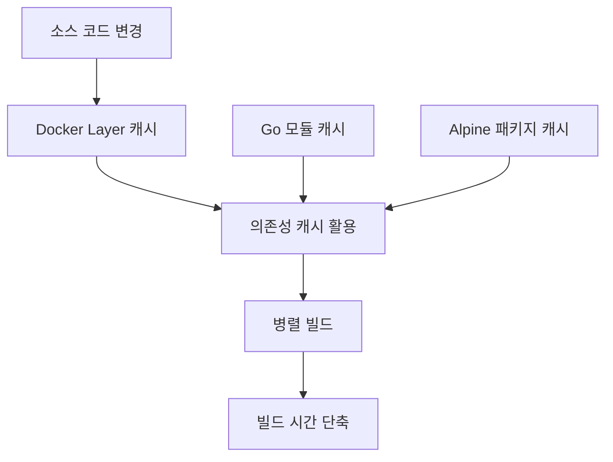
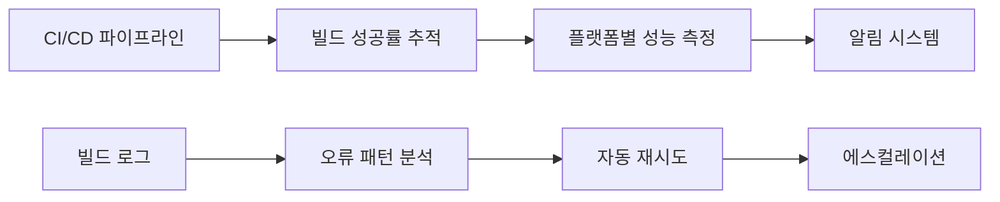
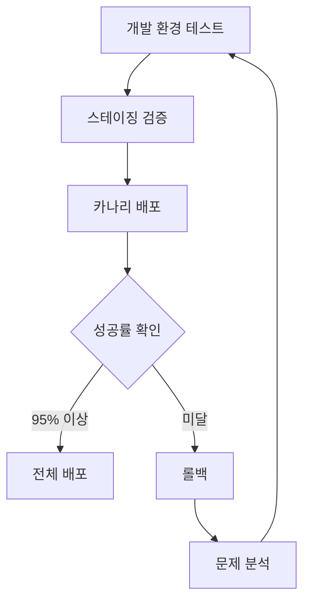
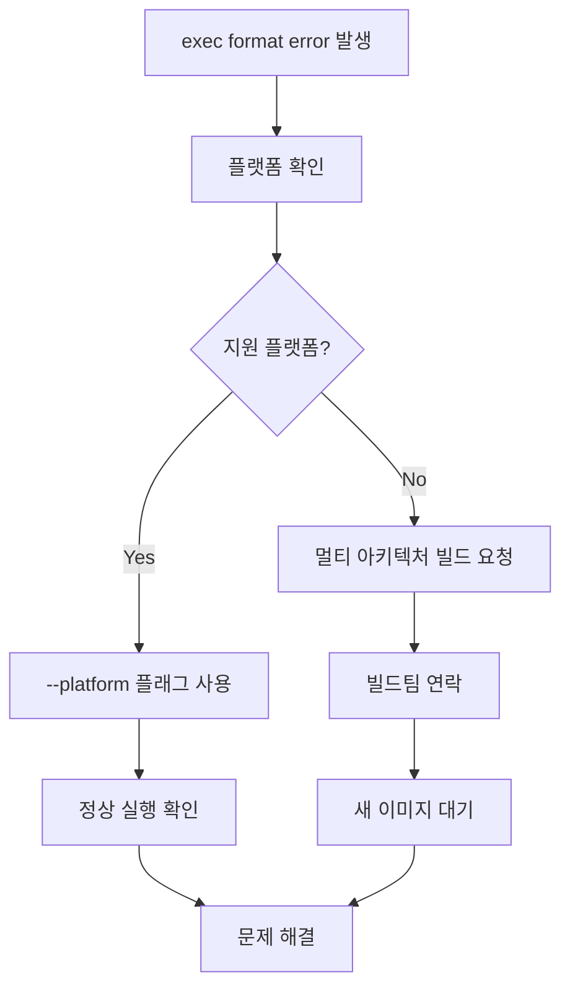

# PIXELZX POS EVM Chain - Exec Format Error 해결 설계

## 개요

PIXELZX POS EVM Chain에서 발생하는 `exec /usr/local/bin/pixelzx: exec format error` 문제는 Docker 컨테이너 실행 시 아키텍처 호환성 문제로 인해 발생합니다. 이 설계 문서는 멀티 아키텍처 지원을 통한 근본적 해결 방안과 즉시 적용 가능한 임시 해결책을 제시합니다.

## 문제 분석

### 근본 원인



### 오류 발생 시나리오

| 빌드 환경 | 실행 환경 | 결과 | 원인 |
|----------|----------|------|------|
| AMD64 | AMD64 | ✅ 정상 | 아키텍처 일치 |
| AMD64 | ARM64 | ❌ exec format error | 아키텍처 불일치 |
| AMD64 | ARM/v7 | ❌ exec format error | 아키텍처 불일치 |

### 오류 메시지 패턴

```bash
exec /usr/local/bin/pixelzx: exec format error
```

이 오류는 다음 상황에서 발생합니다:
- ARM64 Mac에서 AMD64로 빌드된 이미지 실행
- 라즈베리파이에서 AMD64 이미지 실행
- 크로스 플랫폼 Docker 환경에서의 호환성 문제

## 해결 방안 아키텍처

### 1. 멀티 아키텍처 빌드 시스템



### 2. Docker Buildx 기반 크로스 컴파일



## 기술 구현 설계

### 1. Dockerfile 멀티 아키텍처 지원

현재 Dockerfile은 이미 멀티 아키텍처를 지원하도록 구현되어 있습니다:

#### 주요 구성 요소

```dockerfile
# 빌드 인수 정의
ARG BUILDPLATFORM
ARG TARGETPLATFORM  
ARG TARGETOS
ARG TARGETARCH

# 크로스 컴파일 환경 설정
ENV CGO_ENABLED=0
ENV GOOS=${TARGETOS}
ENV GOARCH=${TARGETARCH}
```

#### 플랫폼별 최적화

| 컴포넌트 | AMD64 | ARM64 | ARM/v7 |
|----------|-------|-------|---------|
| 베이스 이미지 | golang:1.21-alpine | golang:1.21-alpine | golang:1.21-alpine |
| 런타임 이미지 | alpine:latest | alpine:latest | alpine:latest |
| CGO 설정 | 비활성화 | 비활성화 | 비활성화 |
| 빌드 플래그 | -s -w | -s -w | -s -w |

### 2. Makefile 빌드 시스템

#### 핵심 명령어 구조



#### 빌드 매개변수

```makefile
PLATFORMS=linux/amd64,linux/arm64,linux/arm/v7
BUILDER_NAME=pixelzx-builder
DOCKER_REGISTRY=yuchanshin
DOCKER_IMAGE=pixelzx-evm
```

### 3. 플랫폼 감지 및 자동 선택



## 즉시 해결 방안

### 1. 플랫폼 명시적 지정

```bash
# 현재 환경에 맞는 플랫폼 확인
uname -m

# AMD64 환경
docker run --platform linux/amd64 yuchanshin/pixelzx-evm:latest

# ARM64 환경 (Apple Silicon)
docker run --platform linux/arm64 yuchanshin/pixelzx-evm:latest

# ARM/v7 환경 (라즈베리파이)
docker run --platform linux/arm/v7 yuchanshin/pixelzx-evm:latest
```

### 2. Docker Compose 환경 변수

```yaml
services:
  pixelzx-node:
    image: yuchanshin/pixelzx-evm:latest
    platform: ${DOCKER_DEFAULT_PLATFORM:-linux/amd64}
    environment:
      - PIXELZX_PLATFORM=${DOCKER_DEFAULT_PLATFORM:-linux/amd64}
```

### 3. 환경별 스크립트

```bash
#!/bin/bash
# detect-platform.sh

ARCH=$(uname -m)
case $ARCH in
    x86_64)
        PLATFORM="linux/amd64"
        ;;
    aarch64|arm64)
        PLATFORM="linux/arm64"
        ;;
    armv7l)
        PLATFORM="linux/arm/v7"
        ;;
    *)
        echo "Unsupported architecture: $ARCH"
        exit 1
        ;;
esac

echo "Detected platform: $PLATFORM"
docker run --platform $PLATFORM yuchanshin/pixelzx-evm:latest "$@"
```

## 진단 및 검증 절차

### 1. 플랫폼 호환성 확인

```bash
# 현재 시스템 아키텍처 확인
uname -m

# Docker 이미지 매니페스트 확인
docker buildx imagetools inspect yuchanshin/pixelzx-evm:latest

# 플랫폼별 이미지 테스트
docker run --platform linux/amd64 yuchanshin/pixelzx-evm:latest version
docker run --platform linux/arm64 yuchanshin/pixelzx-evm:latest version
docker run --platform linux/arm/v7 yuchanshin/pixelzx-evm:latest version
```

### 2. 문제 진단 체크리스트

| 체크 항목 | 명령어 | 예상 결과 |
|----------|--------|-----------|
| 시스템 아키텍처 | `uname -m` | x86_64, aarch64, armv7l |
| Docker 버전 | `docker version` | 20.10+ |
| Buildx 지원 | `docker buildx version` | v0.8+ |
| 이미지 매니페스트 | `docker buildx imagetools inspect` | 멀티 플랫폼 목록 |

### 3. 자동화된 검증 스크립트

```bash
#!/bin/bash
# validate-multiarch.sh

echo "=== PIXELZX 멀티 아키텍처 검증 ==="

# 1. 시스템 정보
echo "1. 시스템 아키텍처: $(uname -m)"
echo "2. 운영체제: $(uname -s)"

# 2. Docker 환경 확인
echo "3. Docker 버전: $(docker version --format '{{.Client.Version}}')"
echo "4. Buildx 지원: $(docker buildx version)"

# 3. 이미지 매니페스트 확인
echo "5. 이미지 매니페스트 검사..."
docker buildx imagetools inspect yuchanshin/pixelzx-evm:latest

# 4. 플랫폼별 실행 테스트
for platform in "linux/amd64" "linux/arm64" "linux/arm/v7"; do
    echo "6. 플랫폼 테스트: $platform"
    if docker run --platform $platform --rm yuchanshin/pixelzx-evm:latest version; then
        echo "   ✅ $platform: 성공"
    else
        echo "   ❌ $platform: 실패"
    fi
done

echo "=== 검증 완료 ==="
```

## 성능 최적화

### 1. 빌드 성능 개선



#### 캐시 최적화 전략

| 레이어 | 캐시 전략 | 효과 |
|--------|----------|------|
| Go 모듈 | `go.mod`, `go.sum` 먼저 복사 | 의존성 변경시만 재다운로드 |
| 소스 코드 | 마지막에 복사 | 코드 변경시 최소 레이어만 재빌드 |
| 시스템 패키지 | Alpine 패키지 캐시 | 베이스 이미지 재사용 |

### 2. 런타임 최적화

```dockerfile
# 바이너리 최적화
RUN go build -ldflags "-s -w" -o bin/pixelzx ./cmd/pixelzx

# 실행 권한 최적화  
RUN chmod +x /usr/local/bin/pixelzx

# 사용자 권한 최적화
USER pixelzx
```

### 3. 이미지 크기 최적화

| 최적화 기법 | 크기 절약 | 적용 방법 |
|------------|----------|-----------|
| 멀티 스테이지 빌드 | ~50MB | 빌드 도구 분리 |
| Alpine Linux | ~20MB | 경량 베이스 이미지 |
| 바이너리 스트리핑 | ~5MB | -ldflags "-s -w" |
| 불필요한 파일 제거 | ~2MB | .dockerignore 활용 |

## 모니터링 및 알림

### 1. 빌드 모니터링



### 2. 런타임 모니터링

```bash
# 컨테이너 헬스체크
HEALTHCHECK --interval=30s --timeout=10s --start-period=5s --retries=3 \
    CMD /usr/local/bin/pixelzx version || exit 1

# 플랫폼 정보 로깅
ENV PIXELZX_PLATFORM=${TARGETPLATFORM}
```

### 3. 알림 및 대응

| 모니터링 대상 | 임계값 | 알림 채널 | 대응 방안 |
|------------|-------|----------|-----------|
| 빌드 실패율 | >5% | Slack/Email | 자동 재빌드 |
| 실행 오류 | exec format error | 즉시 알림 | 플랫폼 확인 안내 |
| 성능 저하 | 시작 시간 >30초 | 모니터링 대시보드 | 리소스 최적화 |

## 배포 전략

### 1. 단계적 배포



### 2. 플랫폼별 배포 검증

```bash
# 배포 전 검증 스크립트
for platform in linux/amd64 linux/arm64 linux/arm/v7; do
    echo "Testing $platform..."
    docker run --platform $platform --rm \
        yuchanshin/pixelzx-evm:latest version
done
```

### 3. 자동화된 배포 파이프라인

```yaml
# GitHub Actions 예시
- name: Multi-platform build and test
  run: |
    make buildx-setup
    make docker-push-multi
    make docker-test-multi

- name: Verify deployment
  run: |
    ./scripts/validate-multiarch.sh
```

## 문제 해결 가이드

### 1. 일반적인 오류 및 해결책

| 오류 유형 | 원인 | 해결책 |
|----------|------|-------|
| exec format error | 아키텍처 불일치 | `--platform` 플래그 사용 |
| no matching manifest | 이미지 플랫폼 미지원 | 멀티 아키텍처 이미지 재빌드 |
| buildx not found | Docker 버전 낮음 | Docker 20.10+ 업그레이드 |

### 2. 진단 명령어

```bash
# 1. 플랫폼 정보 확인
docker info | grep -i arch

# 2. 이미지 매니페스트 상세 조회
docker manifest inspect yuchanshin/pixelzx-evm:latest

# 3. 특정 플랫폼으로 강제 실행
docker run --platform linux/$(uname -m) yuchanshin/pixelzx-evm:latest version
```

### 3. 복구 절차



## 향후 개선 사항

### 1. 추가 플랫폼 지원

```bash
# 확장 예정 플랫폼
EXTENDED_PLATFORMS=linux/amd64,linux/arm64,linux/arm/v7,linux/riscv64,linux/ppc64le
```

### 2. 자동화 개선

- CI/CD 파이프라인에서 자동 멀티 아키텍처 빌드
- 플랫폼별 성능 벤치마크 자동화
- 배포 전 자동 검증 강화

### 3. 사용자 경험 개선

- 플랫폼 자동 감지 스크립트 제공
- Docker Compose 템플릿 개선
- 설치 가이드 플랫폼별 최적화