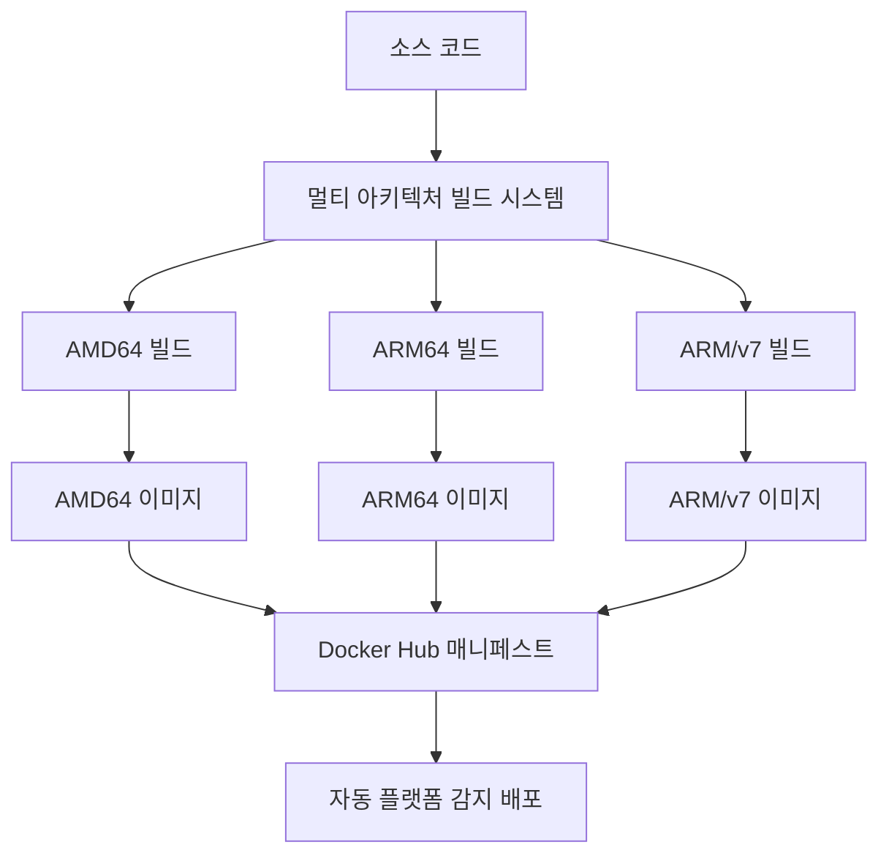
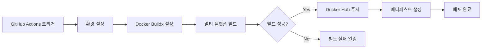
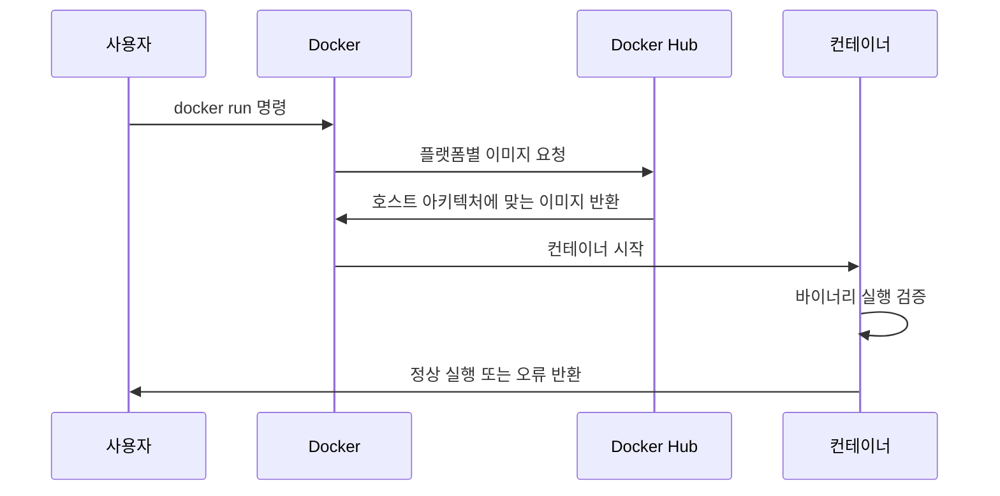
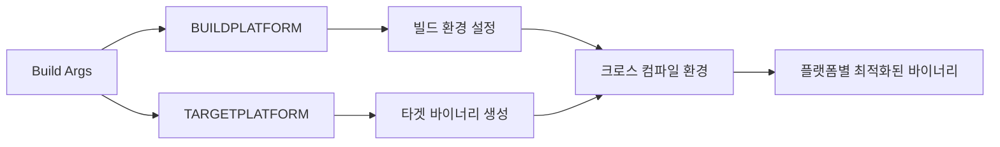
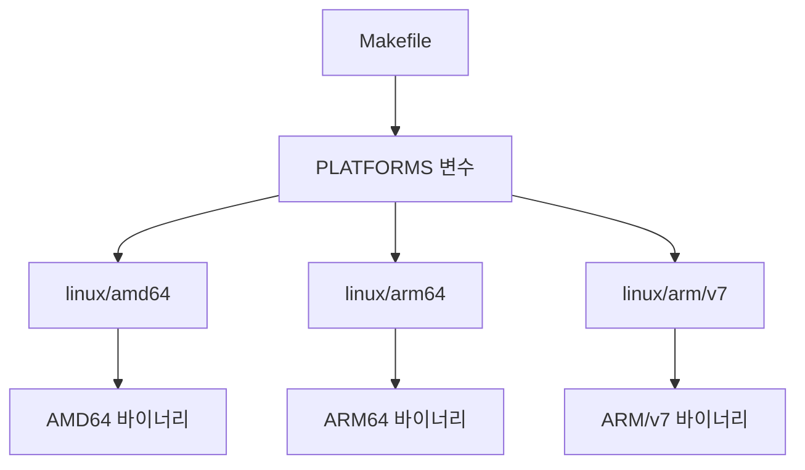
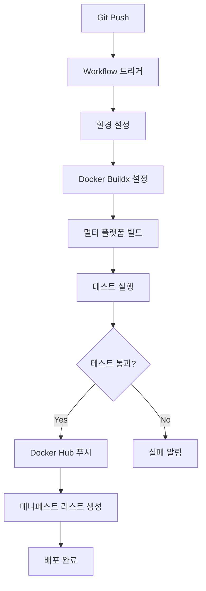
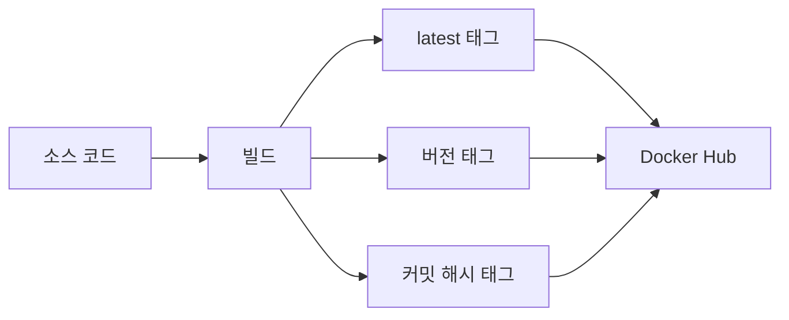
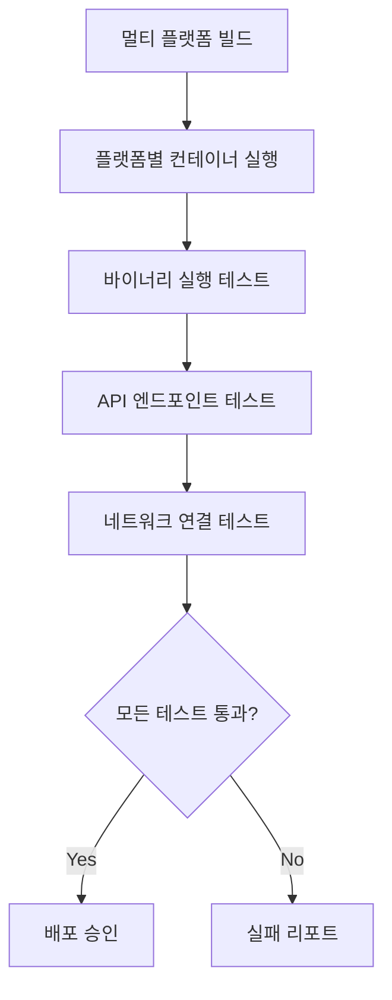
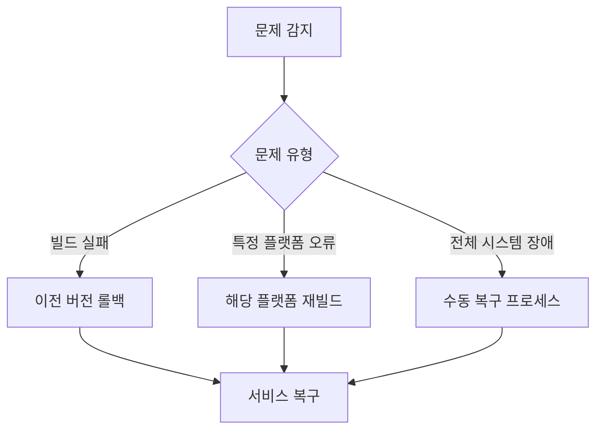

# PIXELZX POS EVM Chain - Exec Format Error 해결 설계

## 1. 개요

### 문제 정의
PIXELZX POS EVM 체인의 Docker 컨테이너 실행 시 발생하는 `exec /usr/local/bin/pixelzx: exec format error` 문제를 해결하기 위한 종합적인 설계입니다.

### 핵심 원인
- **아키텍처 불일치**: 빌드 플랫폼과 실행 플랫폼 간 CPU 아키텍처 차이 (AMD64 vs ARM64)
- **크로스 플랫폼 빌드 미지원**: 현재 Dockerfile이 멀티 아키텍처 빌드를 지원하지 않음
- **플랫폼별 바이너리 분리 부족**: 단일 바이너리로 모든 플랫폼을 지원하려는 구조적 문제

### 해결 목표
- 멀티 아키텍처 지원으로 크로스 플랫폼 호환성 확보
- 자동화된 플랫폼별 빌드 시스템 구축
- Docker Hub 배포 시 모든 주요 플랫폼 지원

## 2. 아키텍처 설계

### 2.1 멀티 아키텍처 빌드 전략



### 2.2 빌드 파이프라인 아키텍처



### 2.3 컨테이너 실행 플로우



## 3. 해결 방안 설계

### 3.1 Dockerfile 개선

#### 3.1.1 멀티 스테이지 크로스 빌드 지원

| 구성 요소 | 기존 | 개선안 |
|----------|------|--------|
| 베이스 이미지 | `golang:1.21-alpine` | `--platform=$BUILDPLATFORM golang:1.21-alpine` |
| 빌드 타겟 | 단일 플랫폼 | `TARGETOS`, `TARGETARCH` 환경변수 활용 |
| 크로스 컴파일 | 미지원 | `CGO_ENABLED=0 GOOS=$TARGETOS GOARCH=$TARGETARCH` |

#### 3.1.2 플랫폼별 최적화



### 3.2 Makefile 확장

#### 3.2.1 멀티 아키텍처 빌드 명령어

| 명령어 | 목적 | 지원 플랫폼 |
|--------|------|-------------|
| `make docker-build-multi` | 멀티 플랫폼 빌드 | linux/amd64, linux/arm64, linux/arm/v7 |
| `make docker-push-multi` | 멀티 플랫폼 푸시 | 전체 플랫폼 |
| `make docker-test-multi` | 플랫폼별 테스트 | 개별 플랫폼 검증 |

#### 3.2.2 빌드 파라미터 매트릭스



### 3.3 Docker Buildx 설정

#### 3.3.1 Builder 인스턴스 구성

| 설정 항목 | 값 | 목적 |
|-----------|---|------|
| Builder 이름 | `pixelzx-builder` | 전용 빌더 인스턴스 |
| 드라이버 | `docker-container` | 멀티 플랫폼 지원 |
| 플랫폼 | `linux/amd64,linux/arm64,linux/arm/v7` | 주요 아키텍처 지원 |

### 3.4 CI/CD 파이프라인 설계

#### 3.4.1 GitHub Actions 워크플로우



## 4. 구현 상세 설계

### 4.1 Dockerfile 개선 사항

#### 4.1.1 ARG 및 ENV 변수 추가

```dockerfile
# 플랫폼 정보를 위한 ARG 변수
ARG BUILDPLATFORM
ARG TARGETPLATFORM
ARG TARGETOS
ARG TARGETARCH
```

#### 4.1.2 크로스 컴파일 설정

```dockerfile
# 크로스 컴파일 환경 변수
ENV CGO_ENABLED=0
ENV GOOS=${TARGETOS}
ENV GOARCH=${TARGETARCH}
```

### 4.2 Makefile 확장

#### 4.2.1 플랫폼 변수 정의

```makefile
# 지원 플랫폼 정의
PLATFORMS=linux/amd64,linux/arm64,linux/arm/v7
BUILDER_NAME=pixelzx-builder
```

#### 4.2.2 새로운 빌드 타겟

| 타겟 | 기능 | 의존성 |
|------|------|--------|
| `buildx-setup` | Docker Buildx 설정 | docker |
| `docker-build-multi` | 멀티 플랫폼 빌드 | buildx-setup |
| `docker-push-multi` | 멀티 플랫폼 푸시 | docker-build-multi |

### 4.3 배포 전략

#### 4.3.1 이미지 태깅 전략



#### 4.3.2 롤백 전략

| 상황 | 대응 방안 | 복구 시간 |
|------|-----------|-----------|
| 빌드 실패 | 이전 안정 버전으로 롤백 | 5분 이내 |
| 런타임 오류 | 특정 플랫폼 이미지 재빌드 | 10분 이내 |
| 전체 장애 | 수동 빌드 및 배포 | 30분 이내 |

## 5. 테스팅 전략

### 5.1 플랫폼별 테스트 매트릭스

| 플랫폼 | 테스트 환경 | 검증 항목 |
|--------|-------------|-----------|
| linux/amd64 | GitHub Actions Ubuntu | 바이너리 실행, API 테스트 |
| linux/arm64 | QEMU 에뮬레이션 | 크로스 플랫폼 호환성 |
| linux/arm/v7 | QEMU 에뮬레이션 | 기본 기능 동작 |

### 5.2 자동화된 테스트 플로우



### 5.3 검증 항목

#### 5.3.1 기본 기능 테스트

| 테스트 케이스 | 기대 결과 | 우선순위 |
|---------------|-----------|----------|
| `pixelzx version` | 버전 정보 출력 | 높음 |
| `pixelzx init` | 제네시스 파일 생성 | 높음 |
| `pixelzx start` | 노드 정상 시작 | 높음 |
| API 엔드포인트 | JSON-RPC 응답 | 중간 |

## 6. 모니터링 및 관찰성

### 6.1 빌드 모니터링


### 6.2 런타임 모니터링

| 메트릭 | 수집 방법 | 알림 임계값 |
|--------|-----------|-------------|
| 컨테이너 시작 시간 | Docker stats | 30초 초과 |
| 바이너리 실행 성공률 | Health check | 95% 미만 |
| 플랫폼별 다운로드 수 | Docker Hub API | - |

## 7. 위험 관리

### 7.1 잠재적 위험 요소

| 위험 요소 | 확률 | 영향도 | 완화 방안 |
|-----------|------|--------|-----------|
| QEMU 에뮬레이션 성능 저하 | 중간 | 낮음 | 네이티브 ARM 빌더 추가 |
| 크로스 컴파일 오류 | 낮음 | 높음 | 철저한 테스트 및 검증 |
| Docker Hub 레이트 리밋 | 낮음 | 중간 | 프라이빗 레지스트리 백업 |

### 7.2 비상 대응 계획

