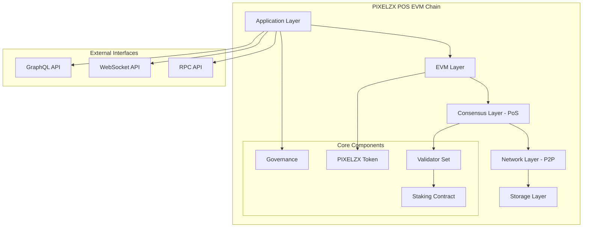
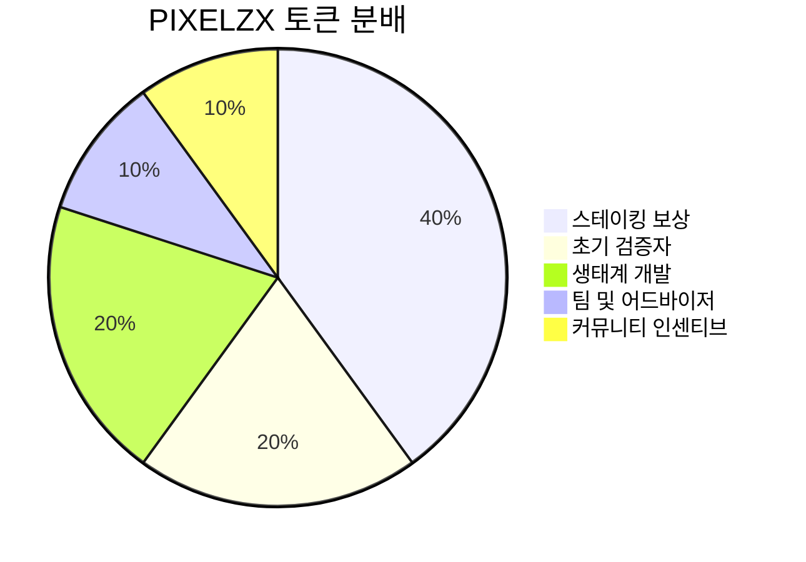
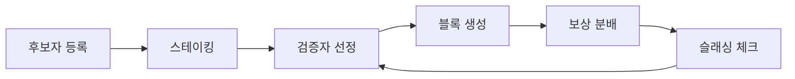
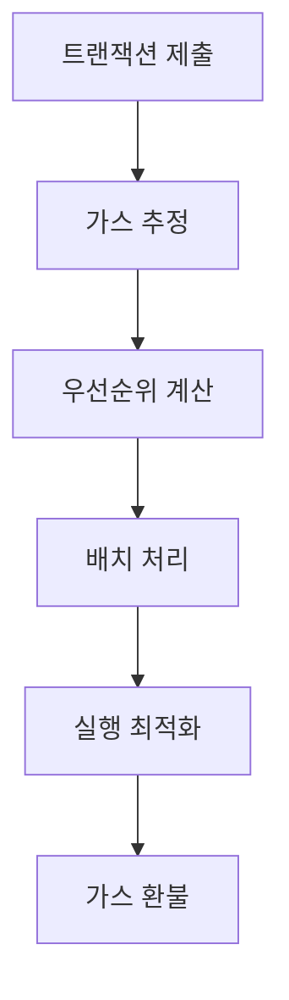
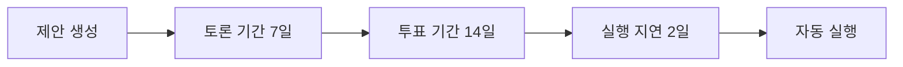
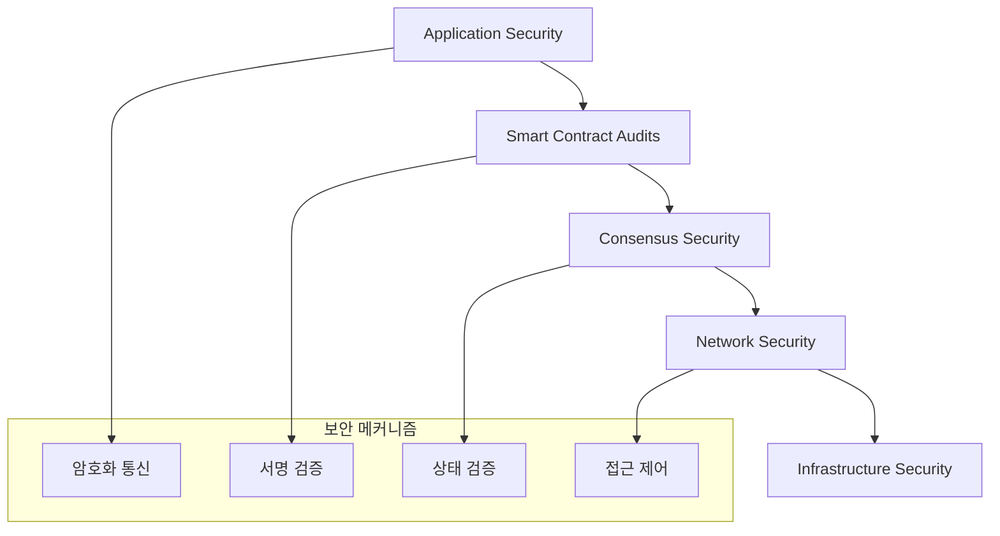
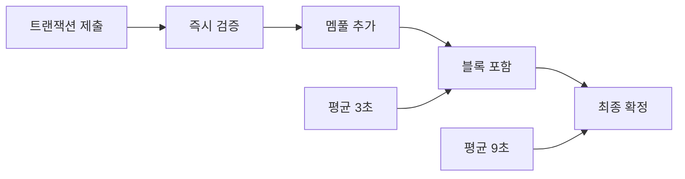
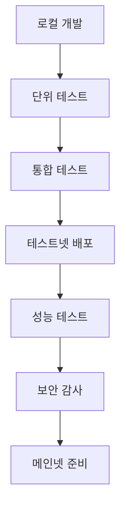

# PIXELZX POS EVM Chain 설계

## 개요

PIXELZX를 네이티브 토큰으로 하는 Proof of Stake (POS) 기반 Ethereum Virtual Machine (EVM) 호환 블록체인 네트워크입니다. 이 체인은 높은 처리량, 낮은 수수료, 그리고 기존 Ethereum 생태계와의 완전한 호환성을 제공합니다.

### 핵심 특징
- **네이티브 토큰**: PIXELZX
- **합의 메커니즘**: Proof of Stake (PoS)
- **EVM 호환성**: 완전한 Ethereum 스마트 컨트랙트 지원
- **높은 성능**: 3초 블록 타임, 1000+ TPS
- **낮은 수수료**: 가스비 최적화

## 아키텍처

### 전체 시스템 아키텍처



### 계층별 구조

#### 1. Application Layer (애플리케이션 계층)
- DApp 인터페이스
- 사용자 트랜잭션 처리
- API 엔드포인트 관리

#### 2. EVM Layer (실행 계층)
- Ethereum 가상 머신
- 스마트 컨트랙트 실행
- 가스 계산 및 최적화

#### 3. Consensus Layer (합의 계층)
- PoS 합의 알고리즘
- 블록 생성 및 검증
- 슬래싱 메커니즘

#### 4. Network Layer (네트워크 계층)
- P2P 통신
- 노드 디스커버리
- 블록 전파

#### 5. Storage Layer (저장 계층)
- 상태 저장소
- 블록체인 데이터베이스
- 스냅샷 관리

## PIXELZX 토큰 설계

### 토큰 사양

| 속성 | 값 |
|------|-----|
| 토큰명 | PIXELZX |
| 심볼 | PXZ |
| 총 공급량 | 1,000,000,000 PXZ |
| 소수점 자리수 | 18 |
| 토큰 타입 | 네이티브 토큰 |

### 토큰 분배



### 토큰 유틸리티

1. **가스비**: 모든 트랜잭션의 수수료
2. **스테이킹**: 검증자 노드 운영을 위한 담보
3. **거버넌스**: 네트워크 업그레이드 투표권
4. **보상**: 블록 생성 및 검증 보상

## PoS 합의 메커니즘

### 검증자 시스템



### 스테이킹 요구사항

| 역할 | 최소 스테이킹 | 보상률 |
|------|---------------|--------|
| 검증자 | 100,000 PXZ | 8-12% APR |
| 위임자 | 1 PXZ | 6-10% APR |

### 슬래싱 조건

1. **이중 서명**: 같은 높이에서 두 개의 블록 서명
2. **다운타임**: 연속 100 블록 이상 오프라인
3. **잘못된 검증**: 무효한 트랜잭션 포함

**슬래싱 페널티**: 스테이킹된 토큰의 5-30%

## EVM 호환성

### 지원 기능

- **Solidity 컴파일러**: 완전 호환
- **Web3.js/Ethers.js**: 기존 라이브러리 사용 가능
- **메타마스크**: 직접 연결 지원
- **트러플/하드햇**: 개발 도구 호환

### 가스 최적화



### 가스비 구조

| 연산 타입 | 가스 비용 | 최적화 |
|-----------|-----------|--------|
| 기본 전송 | 21,000 gas | - |
| 컨트랙트 호출 | 25,000+ gas | 20% 할인 |
| 저장소 쓰기 | 20,000 gas | 배치 처리 |
| 저장소 읽기 | 800 gas | 캐싱 |

## 네트워크 구성

### 노드 타입

1. **검증자 노드**
   - 블록 생성 및 검증
   - 풀 상태 유지
   - 24/7 운영 필수

2. **풀 노드**
   - 전체 블록체인 동기화
   - 트랜잭션 중계
   - API 서비스 제공

3. **라이트 노드**
   - 블록 헤더만 동기화
   - 모바일/IoT 기기용
   - 빠른 동기화

### 네트워크 파라미터

| 파라미터 | 값 |
|----------|-----|
| 블록 타임 | 3초 |
| 블록 크기 제한 | 30MB |
| 가스 제한 | 30,000,000 |
| 최대 검증자 수 | 125 |
| 언본딩 기간 | 21일 |

## 거버넌스 시스템

### 제안 프로세스



### 투표권

- **1 PXZ = 1 투표권**
- **최소 제안 임계값**: 100,000 PXZ
- **통과 조건**: 과반수 찬성 + 20% 이상 참여율

### 거버넌스 주제

1. 네트워크 파라미터 변경
2. 프로토콜 업그레이드
3. 수수료 구조 조정
4. 검증자 세트 변경

## 보안 모델

### 다층 보안 구조



### 보안 기능

1. **암호화**: secp256k1 타원곡선 암호화
2. **해시**: Keccak-256 해시 함수
3. **서명**: ECDSA 디지털 서명
4. **랜덤성**: VRF 기반 검증자 선택

## API 인터페이스

### JSON-RPC API

#### 기본 메서드

```json
{
  "eth_blockNumber": "최신 블록 번호 조회",
  "eth_getBalance": "계정 잔액 조회",
  "eth_sendTransaction": "트랜잭션 전송",
  "eth_call": "읽기 전용 호출",
  "eth_estimateGas": "가스 사용량 추정"
}
```

#### PIXELZX 확장 메서드

```json
{
  "pxz_getValidators": "활성 검증자 목록",
  "pxz_getStakingInfo": "스테이킹 정보",
  "pxz_getDelegations": "위임 현황",
  "pxz_getGovernanceProposals": "거버넌스 제안 목록"
}
```

### WebSocket API

실시간 이벤트 구독 지원:
- 새 블록 알림
- 트랜잭션 상태 변경
- 스테이킹 이벤트
- 거버넌스 활동

## 성능 최적화

### 처리량 개선

1. **병렬 실행**: 독립적인 트랜잭션 병렬 처리
2. **상태 캐싱**: 자주 접근하는 상태 메모리 캐싱
3. **가스 추정 최적화**: 동적 가스 가격 조정
4. **블록 압축**: 블록 데이터 압축 전송

### 지연시간 최소화



## 개발 도구 및 SDK

### 지원 도구

1. **CLI 도구**: 노드 관리 및 스테이킹
2. **Explorer**: 블록체인 탐색기
3. **Wallet SDK**: 지갑 개발 킷
4. **DApp Framework**: 분산 앱 개발 프레임워크

### 개발자 리소스

- **문서**: 완전한 API 문서
- **튜토리얼**: 단계별 개발 가이드
- **테스트넷**: 개발 및 테스트 환경
- **지원**: 개발자 커뮤니티

## 테스팅 전략

### 테스트 유형

1. **단위 테스트**
   - 개별 컴포넌트 검증
   - 함수별 정확성 확인
   - 커버리지: 90% 이상

2. **통합 테스트**
   - 컴포넌트 간 상호작용
   - API 엔드포인트 검증
   - 데이터 흐름 확인

3. **성능 테스트**
   - TPS 벤치마킹
   - 메모리 사용량 모니터링
   - 네트워크 지연시간 측정

4. **보안 테스트**
   - 펜테스팅
   - 코드 감사
   - 취약점 스캔

### 테스트 환경

