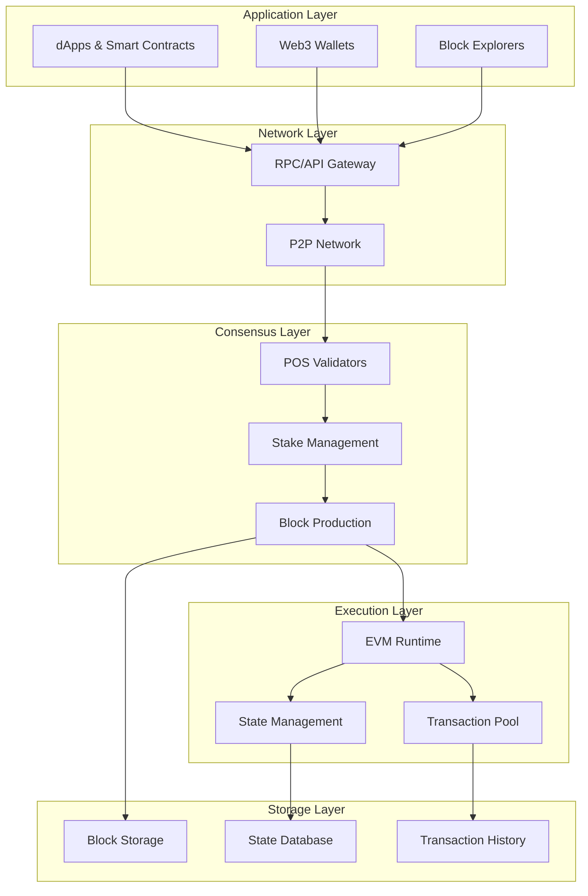
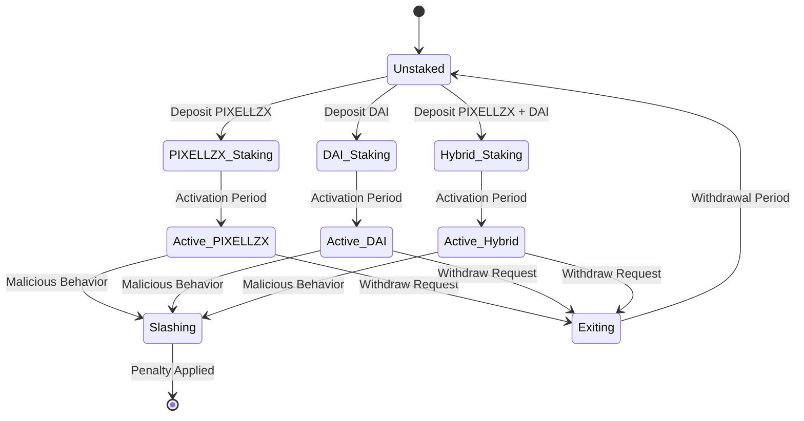
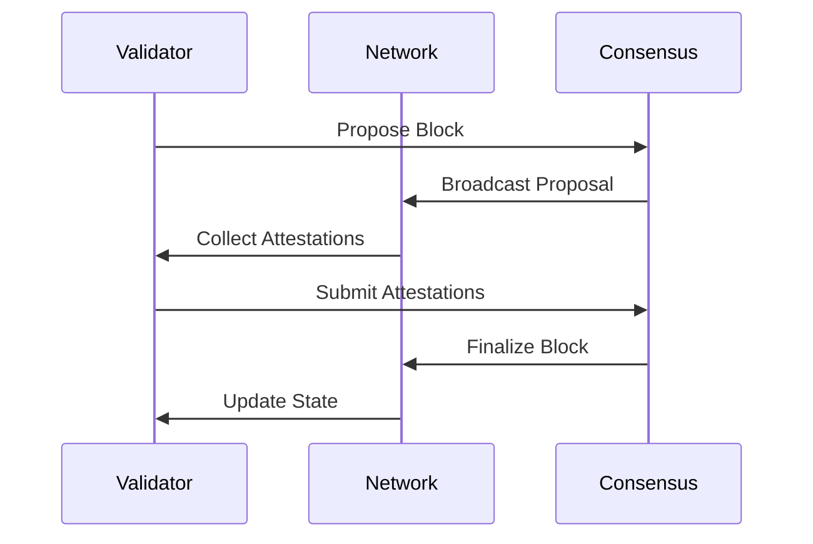
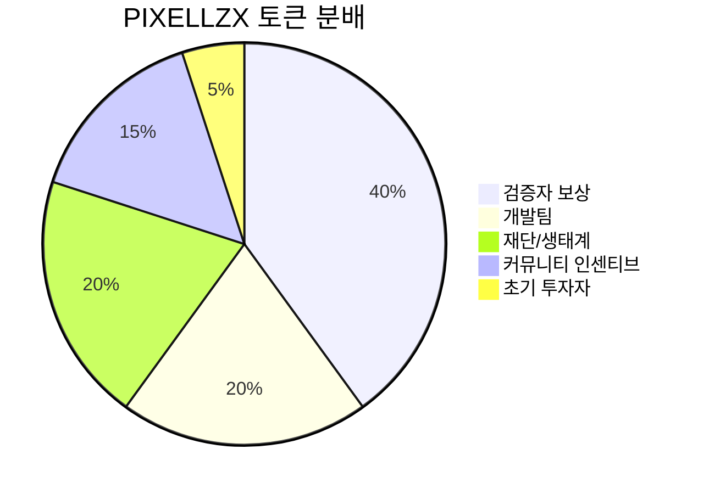
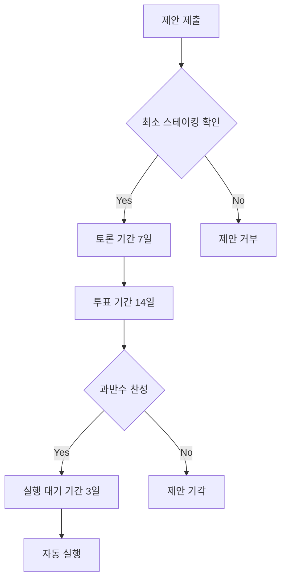
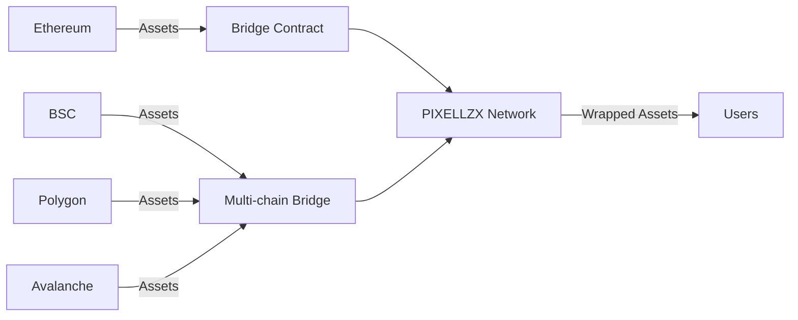
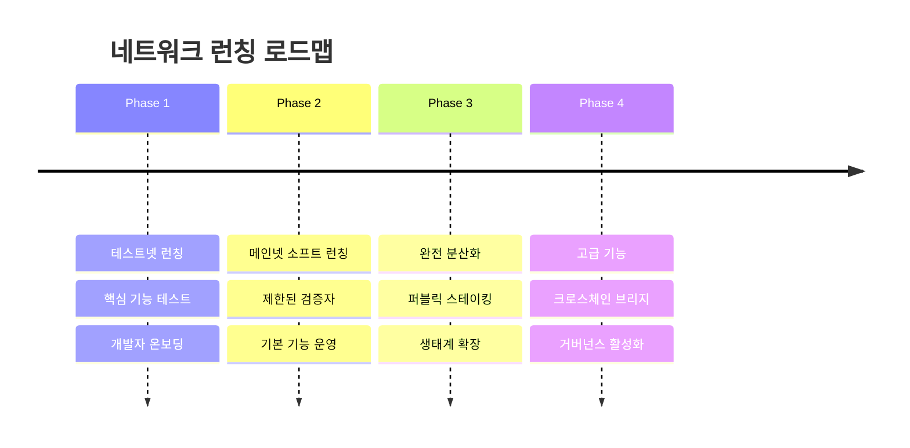

# PIXELLZX POS EVM 네트워크 설계

## 개요

PIXELLZX를 네이티브 토큰으로 하는 Proof of Stake (POS) 기반 Ethereum Virtual Machine (EVM) 호환 블록체인 네트워크입니다. 이 네트워크는 높은 성능, 낮은 가스비, 그리고 완전한 EVM 호환성을 제공하여 기존 Ethereum dApp들이 쉽게 마이그레이션할 수 있도록 설계되었습니다.

### 핵심 특징
- **네이티브 토큰**: PIXELLZX
- **멀티 토큰 스테이킹**: PIXELLZX + DAI 혼합 스테이킹 지원
- **합의 메커니즘**: Proof of Stake (POS)
- **EVM 호환성**: 완전한 Ethereum 호환성
- **높은 처리량**: 초당 수천 건의 트랜잭션 처리
- **낮은 가스비**: 기존 Ethereum 대비 최대 100배 낮은 수수료
- **안정성**: DAI 스테이킹을 통한 가격 안정성 확보

## 아키텍처

### 전체 시스템 아키텍처

### 네트워크 구성 요소

#### 1. 검증자 노드 (Validator Nodes)
- **역할**: 블록 생성 및 검증
- **스테이킹 요구사항**: 
  - 옵션 1: 최소 32,000 PIXELLZX
  - 옵션 2: 20,000 PIXELLZX + 5,000 DAI
  - 옵션 3: 최소 10,000 DAI (DAI 전용 스테이킹)
- **보상 메커니즘**: 스테이킹 토큰 종류에 따른 차등 보상

#### 2. 풀 노드 (Full Nodes)
- **역할**: 네트워크 상태 동기화 및 트랜잭션 중계
- **기능**: RPC 서비스 제공, 블록체인 데이터 저장

#### 3. 라이트 노드 (Light Nodes)
- **역할**: 클라이언트 애플리케이션을 위한 경량 접근
- **기능**: 필요한 데이터만 선택적 동기화

## 합의 메커니즘 (POS)

### 멀티 토큰 스테이킹 시스템

#### 멀티 토큰 스테이킹 매개변수

##### PIXELLZX 스테이킹
| 매개변수 | 값 | 설명 |
|---------|-----|------|
| 최소 스테이킹 | 32,000 PIXELLZX | 순수 PIXELLZX 스테이킹 최소 요구량 |
| 활성화 기간 | 256 에포크 | 스테이킹 후 검증자 활성화까지의 대기 시간 |
| 출금 기간 | 256 에포크 | 출금 요청 후 실제 출금까지의 대기 시간 |
| 슬래싱 비율 | 5-100% | 악의적 행동에 대한 페널티 비율 |
| 보상 비율 | 기본 100% | 네이티브 토큰 스테이킹 기본 보상 |

##### DAI 스테이킹
| 매개변수 | 값 | 설명 |
|---------|-----|------|
| 최소 스테이킹 | 10,000 DAI | 순수 DAI 스테이킹 최소 요구량 |
| 활성화 기간 | 128 에포크 | 스테이블코인의 빠른 활성화 |
| 출금 기간 | 128 에포크 | DAI 출금 대기 시간 |
| 슬래싱 비율 | 3-50% | PIXELLZX 대비 낮은 슬래싱 |
| 보상 비율 | 70% | PIXELLZX 보상의 70% 수준 |

##### 혼합 스테이킹 (PIXELLZX + DAI)
| 매개변수 | 값 | 설명 |
|---------|-----|------|
| 최소 스테이킹 | 20,000 PIXELLZX + 5,000 DAI | 혼합 스테이킹 최소 요구량 |
| 활성화 기간 | 192 에포크 | 중간 수준의 활성화 기간 |
| 출금 기간 | 192 에포크 | 혼합 스테이킹 출금 대기 시간 |
| 슬래싱 비율 | 4-75% | 가중 평균 슬래싱 비율 |
| 보상 비율 | 85% | 두 토큰의 가중 평균 보상 |

### 블록 생성 프로세스

## EVM 호환성

### 지원되는 기능
- **스마트 컨트랙트**: Solidity, Vyper 등 Ethereum 개발 언어 완전 지원
- **JSON-RPC API**: Ethereum JSON-RPC 표준 완전 구현
- **Web3 라이브러리**: web3.js, ethers.js 등 기존 라이브러리와 호환
- **개발 도구**: Remix, Truffle, Hardhat 등 기존 도구 사용 가능

### 가스 시스템
- **기본 가스 가격**: 1 Gwei = 0.000000001 PIXELLZX
- **동적 가스 조정**: 네트워크 혼잡도에 따른 자동 조정
- **가스 한도**: 블록당 30,000,000 가스

## 네트워크 매개변수

### 블록 생성
| 매개변수 | 값 | 설명 |
|---------|-----|------|
| 블록 시간 | 2초 | 평균 블록 생성 간격 |
| 에포크 길이 | 32 블록 | 하나의 에포크를 구성하는 블록 수 |
| 최대 블록 크기 | 30MB | 단일 블록의 최대 크기 |
| 트랜잭션 처리량 | 3,000+ TPS | 초당 최대 트랜잭션 처리 수 |

### 네트워크 보안
- **최소 검증자 수**: 128개
- **비잔틴 결함 허용**: 33% 미만의 악의적 검증자 허용
- **슬래싱 조건**: 이중 서명, 부재 등에 대한 자동 페널티

## 토큰경제학 (PIXELLZX)

### 토큰 분배

### 인플레이션 모델
- **연간 인플레이션율**: 3-7% (스테이킹 참여율에 따라 조정)
- **최대 공급량**: 없음 (인플레이션 제어를 통한 관리)
- **소각 메커니즘**: 가스비의 일부 소각을 통한 디플레이션 압력

### 멀티 토큰 보상 시스템

#### PIXELLZX 스테이커 보상
- **블록 생성 보상**: 블록당 2 PIXELLZX
- **검증 보상**: 에포크당 스테이킹량의 0.01%
- **추가 네이티브 보너스**: 5% 추가 보상

#### DAI 스테이커 보상
- **블록 생성 보상**: 블록당 1.4 PIXELLZX (70% 비율)
- **검증 보상**: 에포크당 스테이킹량의 0.007%
- **안정성 보너스**: DAI 스테이킹량에 비례한 추가 PIXELLZX 보상

#### 혼합 스테이커 보상
- **블록 생성 보상**: 블록당 1.7 PIXELLZX (85% 비율)
- **검증 보상**: 가중 평균 비율 적용
- **다양성 보너스**: 두 토큰 모두 스테이킹 시 2% 추가 보상

#### 공통 보상
- **슬래싱 보상**: 신고자에게 슬래싱 금액의 1/512
- **MEV 보상**: 블록 생성자에게 MEV 수익의 90% 분배

## 거버넌스

### 제안 시스템

### 거버넌스 매개변수
| 매개변수 | 값 | 설명 |
|---------|-----|------|
| 제안 최소 스테이킹 | 100,000 PIXELLZX | 제안을 위한 최소 스테이킹 요구량 |
| 투표 기간 | 14일 | 제안에 대한 투표 기간 |
| 실행 지연 | 3일 | 통과된 제안의 실행 지연 시간 |
| 정족수 | 40% | 유효한 투표를 위한 최소 참여율 |

## 보안 모델

### 네트워크 보안
- **암호화**: secp256k1 타원곡선 암호화
- **해시 함수**: Keccak-256
- **서명 스킴**: ECDSA
- **랜덤성**: RANDAO 기반 검증 가능한 랜덤 함수

### 슬래싱 조건
1. **이중 서명**: 같은 높이에서 두 개의 다른 블록 서명
2. **부재**: 연속된 에포크에서 검증 실패
3. **잘못된 검증**: 의도적으로 잘못된 블록 검증

## 상호 운용성

### 브리지 시스템

### 지원 네트워크
- **Ethereum**: 양방향 자산 브리지
- **Binance Smart Chain**: 크로스체인 DeFi 연동
- **Polygon**: Layer 2 솔루션 상호 운용성
- **기타 EVM 네트워크**: 표준화된 브리지 프로토콜

## 개발자 도구 및 생태계

### 개발 환경
- **RPC 엔드포인트**: 표준 Ethereum JSON-RPC API
- **개발 네트워크**: 테스트넷 및 로컬 개발 환경
- **문서화**: 포괄적인 개발자 문서 및 튜토리얼
- **지원 도구**: Remix IDE, MetaMask, Hardhat 등

### 생태계 지원
- **그랜트 프로그램**: 개발자 및 프로젝트 지원
- **해커톤**: 정기적인 개발 경진대회
- **교육 프로그램**: 블록체인 개발자 양성
- **파트너십**: 주요 DeFi 및 NFT 프로젝트와의 협력

## 네트워크 런칭 및 마이그레이션

### 단계별 런칭 계획

### 마이그레이션 지원
- **툴킷 제공**: Ethereum에서 PIXELLZX 네트워크로의 쉬운 마이그레이션
- **호환성 보장**: 기존 스마트 컨트랙트의 무수정 배포 지원
- **인센티브 프로그램**: 초기 마이그레이션 프로젝트에 대한 보상

## 테스팅

### 단위 테스트
- **합의 로직**: POS 알고리즘 및 검증자 선택 로직
- **EVM 실행**: 스마트 컨트랙트 실행 엔진
- **네트워킹**: P2P 통신 및 동기화 프로토콜

### 통합 테스트
- **멀티 노드 테스트**: 다중 검증자 환경에서의 합의 테스트
- **부하 테스트**: 높은 트랜잭션 볼륨에서의 성능 테스트
- **보안 테스트**: 다양한 공격 시나리오에 대한 저항성 테스트

### 테스트넷 운영
- **공개 테스트넷**: 개발자 및 커뮤니티 테스트 환경
- **스트레스 테스트**: 극한 상황에서의 네트워크 안정성 검증
- **호환성 테스트**: 기존 Ethereum 도구들과의 호환성 확인